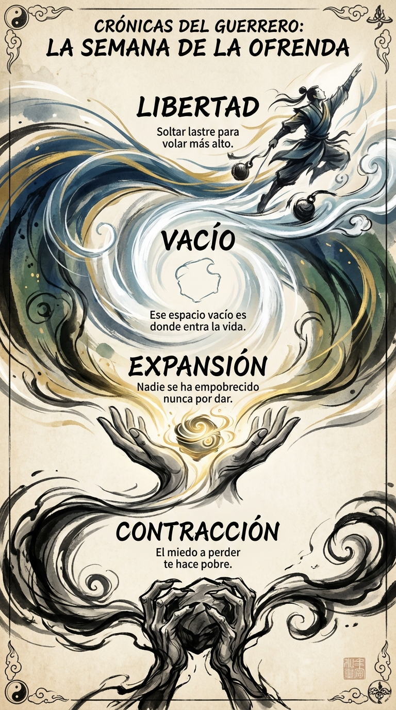

# 21 Noviembre: Resumen Semana 44 - La Ofrenda

> *"Nadie se ha empobrecido nunca por dar."*

### Síntesis Visual
El acto físico de soltar para recibir.
*   **Contracción:** El dolor del ego al perder "lo mío".
*   **Expansión:** La alegría del espíritu al liberarse.
*   **Vacío:** Crear espacio para que entre lo nuevo.

### Puntos Clave
1.  **Desapego:** No eres lo que tienes.
2.  **Flujo:** El agua estancada se pudre; el agua que fluye vive.
3.  **Generosidad:** Dar es la prueba definitiva de abundancia.

### Pregunta de Reflexión
¿Qué estás agarrando con tanta fuerza que te está haciendo daño en la mano?
