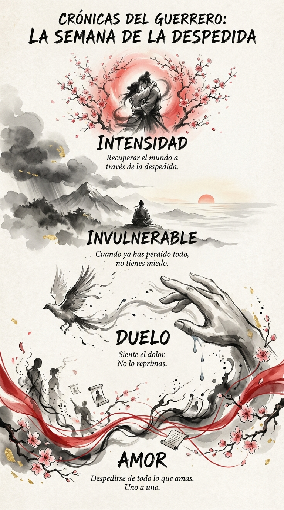

# 28 Noviembre: Resumen Semana 45 - La Despedida

> *"Aprender a decir adiós es aprender a crecer."*

### Síntesis Visual
El ensayo general del final.
*   **Amor:** Solo duele despedirse de lo que importa.
*   **Duelo:** La limpieza emocional necesaria.
*   **Intensidad:** Recuperar el brillo de la vida a través de su posible pérdida.

### Puntos Clave
1.  **Cierre:** No dejes palabras importantes sin decir.
2.  **Invulnerabilidad:** Quien ya lo ha perdido todo (mentalmente), no teme a nada.
3.  **Retorno:** Vuelve a la vida y abrázala como si fuera la última vez.

### Pregunta de Reflexión
¿A quién necesitas decirle "gracias" y "te quiero" hoy mismo?
