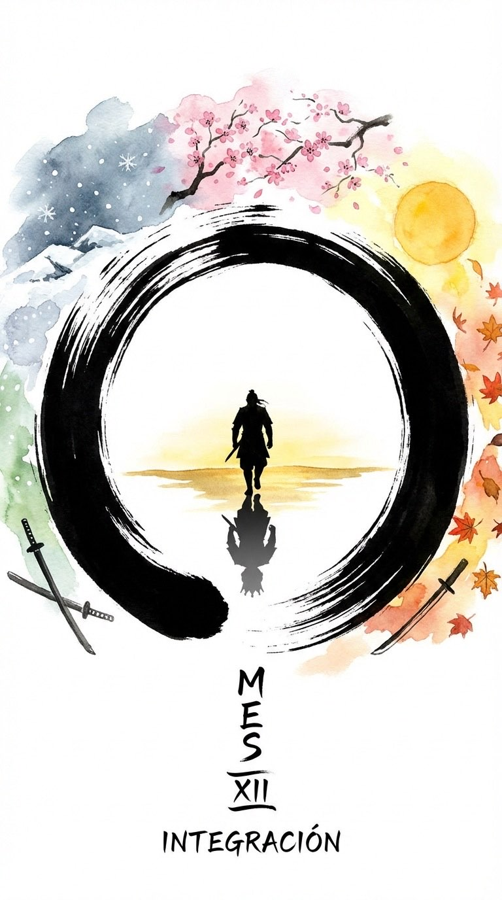

# Introducción al Mes 12: Integración (El Círculo)

> *"El final es el principio. El círculo se cierra."* Cuanto más ayuda a los demás, más se beneficia él mismo. Cuanto más da a los demás, más obtiene él mismo."*
> — **Lao-Tse**, *Tao Te Ching*

Bienvenido al final. Bienvenido al principio.

Has recorrido un largo camino. Empezaste en Enero construyendo los cimientos de la **Disciplina**. Pasaste por el fuego del **Autocontrol**, afinaste tu **Percepción**, te lanzaste a la **Acción**, endureciste tu piel con la **Resistencia**, trazaste planes con **Estrategia**, buscaste la **Maestría**, asumiste el **Poder**, te adaptaste al **Entorno**, combatiste a tu **Ego** y miraste a la cara a la **Muerte**.

Ahora llegamos a Diciembre. El mes de la **Integración**.

En las artes marciales, hay tres etapas de aprendizaje: *Shu, Ha, Ri*.
*   **Shu (Obedecer):** Sigues las reglas rígidamente. Enero fue *Shu*.
*   **Ha (Romper):** Cuestionas las reglas y las adaptas. Los meses intermedios fueron *Ha*.
*   **Ri (Trascender):** Las reglas desaparecen. Tú eres la técnica. Diciembre es *Ri*.

Este mes no se trata de aprender cosas nuevas. Se trata de olvidar lo que sobra.
El guerrero novato busca acumular técnicas: una patada más, un libro más, un truco más. Cree que la fuerza está en la suma.
El maestro sabe que la fuerza está en la resta. En eliminar todo lo que no es esencial hasta que solo queda la verdad pura.

Este mes exploraremos el concepto del **Tao** (el Camino).
El Tao no es una religión ni una filosofía abstracta. Es la realidad funcionando sin fricción. Es el agua que fluye hacia el mar sin esfuerzo, pero con una fuerza imparable.

Veremos cómo **unir los opuestos**: ser duro y suave, rápido y lento, líder y servidor.
Veremos cómo entrar en el estado de **Wu-wei** (acción sin esfuerzo), donde la acción sucede a través de ti, no por ti.
Y finalmente, cerraremos el círculo. Porque en el camino del guerrero, llegar a la cima de la montaña solo sirve para darse cuenta de que hay otra montaña más alta detrás. O mejor aún, para darse cuenta de que la montaña y tú sois lo mismo.

No busques más herramientas. Ya tienes todas las que necesitas.
Ahora, úsalas todas a la vez.

Bienvenido a la Integración.
