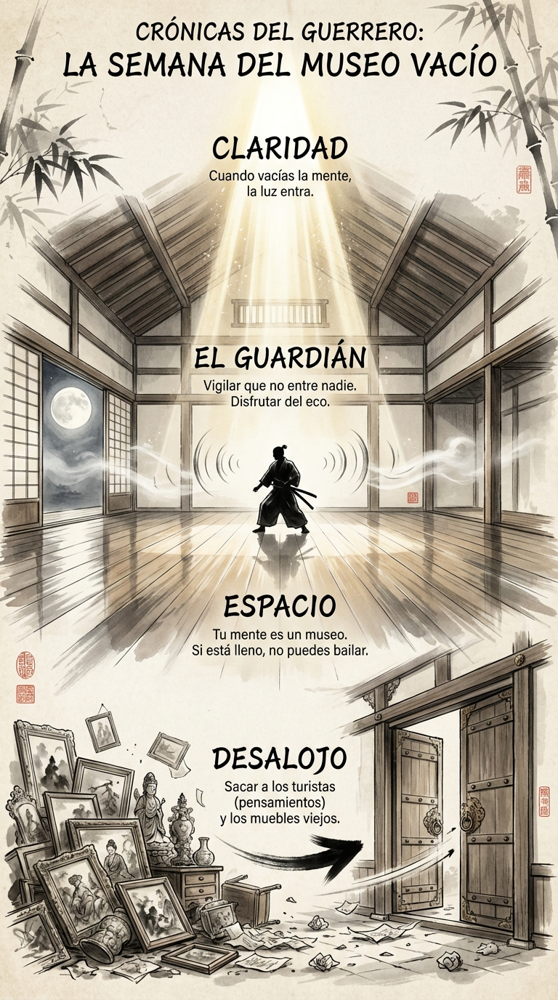

# 07 Diciembre: Resumen Semana 48 - El Museo Vacío

> *"Para que el agua refleje el cielo, debe estar quieta."*

### Síntesis Visual
La limpieza radical de la mente.
*   **Desalojo:** Sacar los muebles viejos y los turistas ruidosos.
*   **Espacio:** La mente necesita vacío para funcionar.
*   **El Guardián:** Proteger tu silencio interior.

### Puntos Clave
1.  **Higiene Neuronal:** No puedes acumular basura mental indefinidamente.
2.  **Claridad:** Solo en una habitación vacía puedes ver la luz.
3.  **Valentía:** Se requiere coraje para echar a tus propios pensamientos.

### Pregunta de Reflexión
¿Tu mente es un museo tranquilo o un mercado ruidoso?
