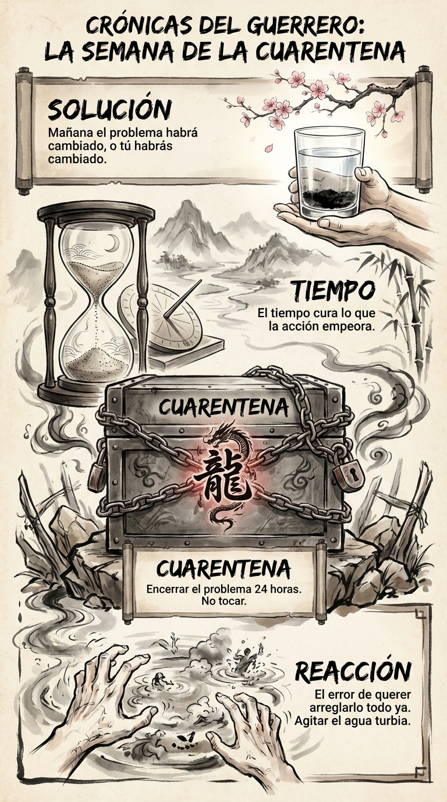

# 21 Diciembre: Resumen Semana 50 - La Cuarentena

> *"El barro se asienta solo si dejas de agitar el agua."*

### Síntesis Visual
La inacción deliberada como estrategia.
*   **Reacción:** El impulso tóxico de "hacer algo" ya.
*   **Cuarentena:** Encerrar el problema para que repose.
*   **Solución:** El tiempo a menudo resuelve lo que la acción empeora.

### Puntos Clave
1.  **Pausa Táctica:** No toques el agua turbia.
2.  **24 Horas:** La regla de oro para decisiones emocionales.
3.  **Autocontrol:** La verdadera fuerza es no actuar cuando todo tu cuerpo te pide actuar.

### Pregunta de Reflexión
¿Qué problema necesitas meter hoy en la "Caja de Cuarentena"?
