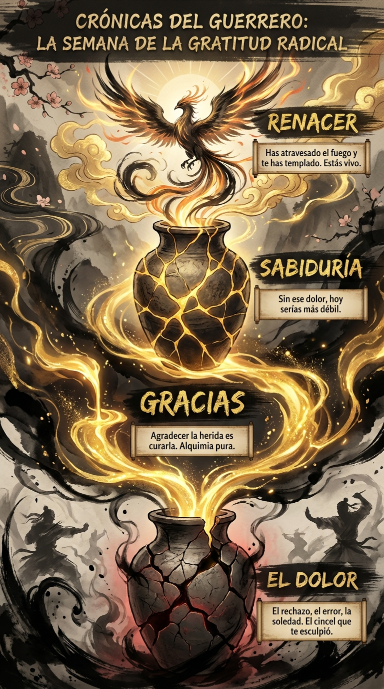

# 28 Diciembre: Resumen Semana 51 - Gratitud Radical

> *"La gratitud es la memoria del corazón."*

### Síntesis Visual
La alquimia de transformar el dolor en oro.
*   **El Dolor:** Las grietas que la vida te ha hecho.
*   **Kintsugi:** Rellenar las heridas con oro (gratitud).
*   **Renacer:** Eres más fuerte en los lugares donde te rompiste.

### Puntos Clave
1.  **Gracias por Todo:** No solo por lo bueno, sino por lo que te forjó.
2.  **Alquimia:** La gratitud cambia la química de tu cerebro.
3.  **Supervivencia:** Estás aquí. Has sobrevivido. Celébralo.

### Pregunta de Reflexión
¿A qué cicatriz vas a dar las gracias hoy?
