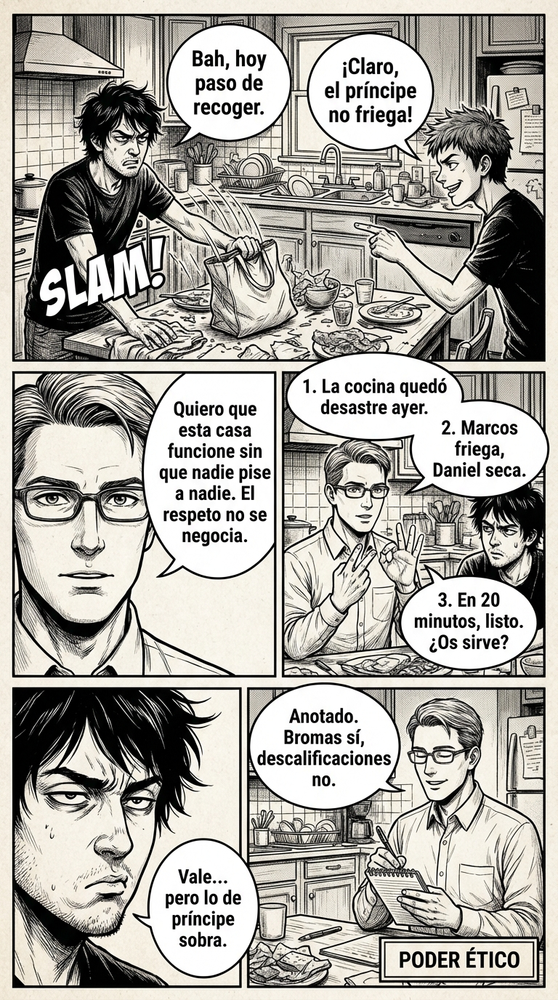

# 1.1 Propósito ético: poder = influencia justa

> **Objetivo de aprendizaje**: Comprender que el poder no es algo "malo" que se tiene, sino una dinámica que se ejerce. Internalizar la ética del "Poder para proteger".

## Relato

La cena del domingo suele ser ruidosa. Marcos llega tarde, tira la mochila y suelta un “bah, hoy paso de recoger”. Daniel bromea: “Claro, el príncipe no friega”. Se oyen risas, de esas que pinchan. Cristina frunce el ceño; Mike respira, deja el vaso y mira a los tres.

—Quiero que esta casa funcione sin que nadie pise a nadie —dice—. Hoy estamos cansados, pero el respeto no se negocia.

Silencio. No hay sermón; solo una pausa clara.

—**[Contexto:]** la cocina quedó hecha un desastre ayer. **[Propuesta:]** Marcos friega, Daniel seca, yo recojo la mesa. **[Siguiente paso:]** en veinte minutos, listo. —Mike mira a Marcos—. ¿Te sirve?

Marcos duda, mira a Daniel, luego a su padre. —Vale… pero lo de “príncipe” sobra.

—**[Validación:]** Anotado —dice Mike, sin elevar el tono—. Y gracias por decirlo.

Daniel levanta las manos: —Perdón. Iba de broma.

—**[Cierro:]** hoy repartimos así; mañana revisamos. La regla: bromas sí, descalificaciones no.

Se ponen en marcha. No hay épica. Solo una sensación tranquila: cada uno sabe qué hacer y por qué. Cuando acaban, Mike vuelve un momento:

—Una cosa más. Si algo os molesta, decídmelo como lo ha hecho Marcos: claro y con respeto. Aquí nos hablamos para entendernos, no para ganarnos.

## Explicación Profunda

En la escena que acabamos de ver, Mike se enfrenta a lo que podríamos llamar una "tormenta perfecta" doméstica: un desafío abierto a la autoridad (Marcos negándose a colaborar) y una agresión lateral (la broma hiriente de Daniel). La mayoría de nosotros, ante una situación así, tendemos a caer en dos trampas opuestas. La primera es la **reactividad emocional**, donde el ego se siente atacado y respondemos con gritos o castigos desproporcionados ("¡Aquí mando yo!"). La segunda es la **evitación pasiva**, donde tragamos el sapo para "no tener fiesta en paz", terminamos recogiendo la mesa nosotros mismos y acumulamos un resentimiento que saldrá más tarde.

Mike elige una tercera vía: el **Poder Ético**. Este concepto no trata de dominar al otro por la fuerza, sino de ejercer influencia para restituir el orden y la dignidad. Lo primero que hace Mike es fundamental: **establecer el marco** antes de discutir la logística. Al decir "el respeto no se negocia", está elevando la conversación desde lo trivial (fregar platos) a lo esencial (cómo nos tratamos). Esto es crucial porque sin un marco compartido de valores, cualquier negociación se convierte en una lucha de egos.

Una vez establecido el terreno de juego, Mike utiliza una herramienta de alta precisión: la estructura **CPS (Contexto, Propuesta, Siguiente Paso)**. Observa cómo esto cambia la dinámica. En lugar de personalizar el conflicto con adjetivos ("eres un vago", "siempre igual"), Mike describe hechos objetivos ("la cocina quedó hecha un desastre") y lanza una solución orientada al futuro. Esta despersonalización reduce la defensividad del otro. No estás atacando su identidad; estás resolviendo un problema común.

Finalmente, el momento más delicado ocurre cuando Marcos se "revuelve" contra la broma de Daniel. Aquí Mike demuestra una **asertividad calibrada**. Podría haber cometido el error de defender a Daniel ("era una broma, no te pongas así") o de ignorar a Marcos para mantener su autoridad. En cambio, **valida** la queja de Marcos ("Anotado, gracias"). Al hacerlo, envía un mensaje poderoso: las reglas se aplican a todos, y tu dignidad es importante para mí. Esto no debilita su liderazgo; lo legitima. El poder ético se nutre de la justicia, no del miedo.

## Síntesis de Ideas Clave

*   **Poder Dinámico**: Entender que toda interacción implica un intercambio de estatus. Ignorarlo te deja vulnerable; gestionarlo te permite protegerte a ti y a los demás.
*   **Asertividad**: La capacidad de expresar necesidades y límites sin violar los derechos ajenos. Se basa en hechos, no en juicios.
*   **Cierre Operativo**: La técnica de definir claramente *quién* hace *qué* y *cuándo*. Elimina la ambigüedad que suele ser caldo de cultivo para futuros conflictos.

## Ejemplos Prácticos

### 1. La Petición Estructurada en Entorno Profesional
*   **Situación**: Tienes que pedir a un compañero que rehaga una parte de un informe mal hecho antes de una reunión.
*   **Acción**: Usa CPS. Evita juicios personales ("esto está mal"). Céntrate en la necesidad del proyecto.
*   **Frase**: *"**[Contexto:]** Para presentar estos datos en la reunión de las 12:00 necesitamos la tabla actualizada. **[Propuesta:]** Por favor, revisa las cifras del Q3. **[Siguiente paso:]** Envíamelo antes de las 11:30 para integrarlo."*
*   **Por qué funciona**: Despersonalizas el error. No es que él trabaje mal, es que la reunión *requiere* datos correctos.

### 2. El Marco de Reglas en Entorno Familiar (Niños)
*   **Situación**: Tus hijos han dejado los juguetes tirados en el salón y es hora de cenar.
*   **Acción**: No grites ni recojas tú enfadado. Define el contexto y da una instrucción en pasos simples.
*   **Frase**: *"**[Contexto:]** El suelo del salón está lleno de piezas y vamos a cenar. **[Propuesta:]** Guardamos todo en la caja roja ahora. **[Siguiente paso:]** Cuando esté limpio, ponemos la mesa."*
*   **Por qué funciona**: Haces que la limpieza sea un prerrequisito lógico para la siguiente actividad (cenar), no un castigo arbitrario.

### 3. La Defensa de Límites en Entorno Social
*   **Situación**: Un amigo hace una broma sobre tu aspecto físico que te molesta, delante de otros.
*   **Acción**: Valida la recepción pero marca el límite sin agresividad. Cierra el tema.
*   **Frase**: *"Ese comentario sobre mi peso me ha sobrado. **[Validación:]** Sé que era broma, pero no me hace gracia. **[Cierre:]** Cambiemos de tema."*
*   **Por qué funciona**: Al decir "sé que era broma" le das una salida digna (no le llamas "malo"), pero con "no me hace gracia" mantienes firme tu respeto.

## Señales de Progreso

1.  **Menos justificaciones "porque..."**:
    *   *¿Has logrado pedir algo sin añadir excusas inmediatas?* Notas que ya no necesitas dar tres razones para pedir algo. Simplemente lo pides. Esto indica que estás internalizando tu *derecho* a tener necesidades y límites, lo que aumenta inmediatamente tu estatus percibido.
2.  **Acuerdos concretos sin gritos**:
    *   *¿La conversación ha terminado con una acción clara ("quién hace qué")?* Las conversaciones terminan con un "trato" o un plan, en lugar de diluirse en el aire. Esto te permite ahorrar energía mental y genera confianza en tu entorno.
3.  **Gestión emocional de la crítica**:
    *   *¿Has conseguido validar la emoción del otro sin ceder en tu objetivo?* Cuando alguien se queja, no sientes un pico de adrenalina/miedo. Puedes decir "te entiendo" y mantener el rumbo. Esto te da una estabilidad inmensa.

## Errores Habituales

*   **El "Over-explaining" (Excesiva justificación)**
    *   *Se ve así*: "Oye, podrías fregar tú, es que yo estoy muy cansado porque el tráfico estaba terrible y además me duele la cabeza..."
    *   *Se ve así*: "No quiero ir, porque claro, si voy entonces mi madre se enfada y..."
    *   *Alternativa*: Ir directo a la Propuesta o al No. "Hoy friegas tú, yo estoy agotado." / "No voy a ir, gracias por invitarme."
*   **El Sermón Moralista**
    *   *Se ve así*: "Es increíble que seáis tan irresponsables, siempre tengo que estar detrás..."
    *   *Se ve así*: "Deberías aprender a comportarte."
    *   *Alternativa*: Marco de reglas neutrales. "En esta casa recogemos lo que ensuciamos. Propongo que empieces ahora."
*   **Preguntar sin esperar respuesta (falsa democracia)**
    *   *Se ve así*: "¿Podrías hacerlo? Venga, hazlo." (Sin pausa).
    *   *Alternativa*: "¿Puedes encargarte?" + **[Silencio real]** hasta que responda Sí o No.

## Conclusiones

Adoptar el Poder Ético requiere un cambio de mentalidad: dejar de ver las interacciones como batallas donde uno gana y otro pierde, y empezar a verlas como negociaciones de convivencia. Al principio puede parecer frío o demasiado técnico usar estructuras como el CPS con tu familia. Es normal. La "calidez" no está en el caos, sino en la claridad.

Cuando eres claro, respetas el tiempo y la mente de los demás. Cuando validas un límite, respetas su dignidad. Ese es el verdadero liderazgo: crear un entorno donde las reglas son justas y conocidas, permitiendo que todos se relajen y cooperen. No buscas obediencia ciega; buscas influencia consciente.

## Práctica Deliberada

*   **Ficha**: [Juego 1: Semáforo del Poder](../juegos/juego_01.md).
*   **Por qué ayuda**: Este juego entrena precisamente la habilidad de pasar de una reacción emocional (roja/ámbar) a una respuesta **CPS (Verde)** baja presión de tiempo. Es el gimnasio perfecto para lo que hemos visto hoy.

