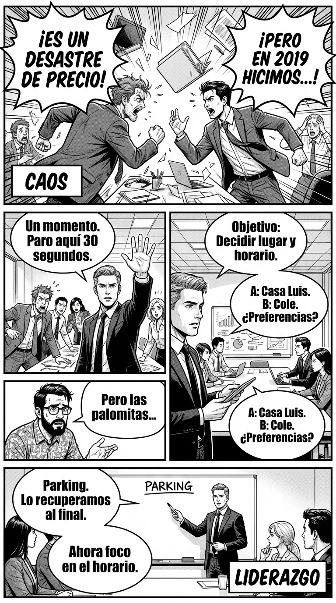

# 1.2 Conducir la conversación: tempo, tono, tema

> **Objetivo de aprendizaje**: Aprender a estructurar una conversación para que vaya a donde tú quieres, en lugar de ser arrastrado por ella.

## Relato

Reunión rápida por la tarde: hay que organizar el viernes de pelis de la clase. Cuatro voces se solapan. Alguien deriva al precio de las palomitas; otra persona entra en una anécdota de 2019.

—Un momento, **[Pausa Táctica:]** paro aquí treinta segundos —dice Mike, abierto de hombros, voz calma—. **[Objetivo:]** decidir lugar y horario. **[Propuesta:]** dos opciones: (A) casa de Luis, 19:00; (B) cole, 18:30, aula grande. ¿Preferencias rápidas?

La sala se ordena. —A mí me da igual —dice alguien.
—Entonces tomo nota como “A” —responde Mike—. Sigo: ¿quién trae proyector?

—Yo puedo —salta Marta—, pero necesito alargador.

—Genial. **[Cierro temporalmente:]** proyector: Marta + alargador. —Mira a la mesa—. ¿Algo fuera de objetivo que queráis tratar después? **[Parking:]** anotamos en aparcamiento.

Uno intenta reabrir el tema de las palomitas: —Pero si en 2019…

—**[Redirección:]** lo recuperamos al final si queda tiempo —sonríe Mike—. **[Siguiente punto:]** normas básicas (recoger, volumen, horario de salida). Propongo tres; ¿añadís alguna?

Diez minutos. Al final, Mike remata: —**[Acuerdo final:]** viernes en el cole 18:30; proyector Marta; normas A, B, C; pendiente palomitas en el “parking”. Gracias.

## Explicación Profunda

Todos hemos estado en esa reunión o cena familiar que parece una "olla de grillos": voces superpuestas, temas que saltan sin lógica y una sensación creciente de pérdida de tiempo. En dinámica de poder, el caos es un vacío. Y el poder aborrece el vacío. Si nadie estructura la conversación, la entropía gana: se hablará de lo más ruidoso o lo más irrelevante, no de lo importante.

Mike recupera el control no compitiendo en volumen, sino cambiando el **Tempo**. Su frase "Paro aquí treinta segundos" actúa como un interruptor de circuito. No pide silencio "por favor" (lo cual puede sonar débil) ni manda callar (agresivo); simplemente *anuncia* una pausa. Al detener el flujo temporal, atrae la atención hacia sí mismo. Es un movimiento de alto estatus: el líder es quien controla el reloj.

Una vez tiene la atención, Mike utiliza el **Control de Marco (Frame Control)** para definir de qué se habla y, más importante aún, de qué *no* se habla. Al explicitar el objetivo ("decidir lugar y horario"), crea una frontera. Todo lo que cae fuera (las palomitas, la anécdota de 2019) es ahora "ilegal" dentro de este marco.

Pero aquí está la clave de su elegancia: el uso del **Parking Lot** (Aparcamiento). Cuando alguien intenta introducir un tema irrelevante, Mike no lo rechaza frontalmente. Rechazar crea enemigos ("¿por qué no me escuchas?"). Aparcar crea aliados ("te escucho, pero ahora no toca"). Al decir "lo anotamos para el final", valida a la persona y protege el objetivo del grupo simultáneamente. Es eficacia social pura.

## Síntesis de Ideas Clave

*   **Liderazgo Conversacional**: Liderar no es hablar más, es gestionar la estructura de la charla: marcar el objetivo, los tiempos y los turnos.
*   **Interrupción de Patrón**: Romper una dinámica caótica con una acción física o verbal inesperada ("paro aquí") para resetear la atención.
*   **Parking Lot (Aparcamiento)**: Herramienta diplomática para posponer temas periféricos sin invalidar al interlocutor, manteniendo el foco principal activo.

## Ejemplos Prácticos

### 1. El Reseteo de Caos en Entorno Profesional
*   **Situación**: Reunión de proyecto donde tres personas discuten a la vez y no se avanza.
*   **Acción**: Interrumpe el patrón temporal. Usa un gesto de "Stop" y define el objetivo inmediato.
*   **Frase**: *"**[Pausa:]** Un momento, equipo. Paramos 20 segundos. **[Objetivo:]** Necesitamos aprobar el presupuesto hoy. Todo lo demás, fuera. ¿Seguimos?"*
*   **Por qué funciona**: Al actuar como "el guardián del tiempo", asumes el liderazgo funcional. Nadie quiere perder tiempo, así que te obedecen por conveniencia.

### 2. El "Parking Lot" en Entorno Familiar
*   **Situación**: Estás negociando la hora de vuelta con tu hijo adolescente y él saca el tema de que "a Juan le dejan más dinero".
*   **Acción**: Valida su queja pero sepárala de la negociación actual.
*   **Frase**: *"Entiendo que el tema de la paga te preocupa. **[Parking:]** Lo anoto para hablarlo el sábado con calma. **[Foco:]** Ahora estamos cerrando tu hora de llegada. ¿A las 22:00 o a las 22:30?"*
*   **Por qué funciona**: No le dices "cállate", le dices "te escucho, pero luego". Evitas que desvíe la atención para ganar terreno en la negociación.

### 3. La Redirección Suave en Entorno Social
*   **Situación**: Cena con amigos. Uno empieza a monopolizar la charla con sus problemas de trabajo aburridos.
*   **Acción**: Cierra su tema validándolo y pasa el turno a otro.
*   **Frase**: *"Menuda historia, tío, vaya paciencia tienes. **[Cierre:]** A ver si mejora la cosa. **[Redirección:]** Por cierto, Ana, ¿qué tal te fue a ti la mudanza?"*
*   **Por qué funciona**: Usas el "puente" de la validación ("vaya paciencia") para cruzar al otro lado (Ana) sin que parezca un corte grosero.

## Señales de Progreso

1.  **Menos ansiedad ante el ruido**:
    *   *¿Sientes que tienes herramientas para intervenir en lugar de sufrir?* En lugar de sufrir pasivamente o desconectar, te ves a ti mismo como el "moderador" potencial. Esa sensación de *agencia* reduce drásticamente el estrés social.
2.  **Reuniones más cortas**:
    *   *¿Habéis logrado cerrar temas en menos tiempo del habitual?* Al usar el "Parking Lot" y definir objetivos, evitas los bucles infinitos. Tu entorno empieza a valorar tu presencia porque las cosas "avanzan" cuando estás tú.
3.  **Capacidad de redirección suave**:
    *   *¿Has cortado a alguien sin que se enfade?* Logras detener una digresión sin herir egos. Significa que estás separando el problema de la persona, y los demás lo perciben como liderazgo profesional, no como rudeza.

## Errores Habituales

*   **Petición de auxilio ("¡Por favor, escuchadme!")**
    *   *Se ve así*: "Oye, chicos, hacedme caso un momento, que es importante..." (Tono suplicante).
    *   *Alternativa*: Tono firme y directivo. "Pausa. Necesito foco aquí."
*   **El debate del tema irrelevante**
    *   *Se ve así*: Alguien dice "Las pizzas de ahí son malas" y tú entras: "No son malas, la masa es fina...". (Has perdido el marco).
    *   *Alternativa*: Parking. "Debate de masas para luego. Ahora: ¿pedimos o no?"
*   **Ser el "Policía Malo"**
    *   *Se ve así*: Mandar callar con agresividad o resoplidos constantes.
    *   *Alternativa*: Usar el "nosotros". "Para que *nos* cunda el tiempo...", "Para que *todos* salgamos antes...".

## Conclusiones

Conducir una conversación conlleva una responsabilidad ética: no se trata de monopolizar el micrófono, sino de cuidar el tiempo y la atención del grupo. El "ladrón de tiempo" suele actuar por inconsciencia o necesidad de atención, no por maldad. Al estructurar la charla, le haces un favor a él (evitas que aburra a los demás) y al grupo (proteges el objetivo común).

Cuando aplicas estas técnicas con elegancia, dejas de ser un participante pasivo para convertirte en un facilitador. Y un buen facilitador es, por definición, una figura de autoridad respetada.

## Práctica Deliberada

*   **Ficha**: [Juego 2: Turno Blindado](../juegos/juego_02.md).
*   **Por qué ayuda**: Para usar el "Parking Lot" o pausar la sala, necesitas primero ser capaz de sostener tu espacio y tu voz ante el caos. Este juego te "vacuna" contra el miedo a ser interrumpido o ignorado, dándote la calma necesaria para liderar.

