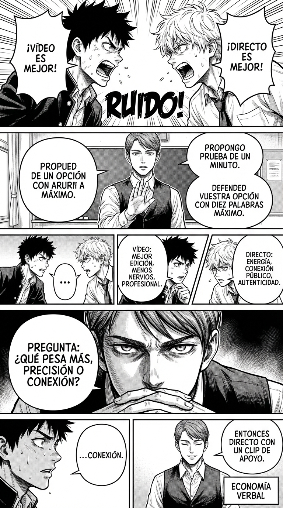

# 1.3 Voz y pausas: impacto con menos palabras

> **Objetivo de aprendizaje**: Descubrir cómo el silencio y la economía verbal aumentan la autoridad percibida y la claridad del mensaje.

## Relato

En el instituto, Jorge y un compañero discuten sobre si presentar en vídeo o en directo. Suben el volumen, se pisan. Mike observa y pide turno con la mano.

—Os propongo una prueba de un minuto —dice, más despacio de lo habitual—. Primero, cada uno defiende su opción con **diez** palabras máximo. Luego decidimos.

Se miran, extrañados.
Jorge: —“Vídeo: mejor edición, menos nervios, repetible; además, queda profesional.”
Compañero: —“Directo: energía, contacto con público, autenticidad; preguntas al final.”

Mike asiente; no llena los silencios. —Bien. Ahora una pregunta: **[Pregunta de encuadre:]** ¿qué objetivo pesa más, precisión o conexión?

Pausa. Nadie habla. Entonces Jorge suelta, más calmado: —Conexión.

—Entonces **directo** con un **clip** de apoyo —dice Mike—. **[Cierro:]** reparto de partes y ensayo breve.

## Explicación Profunda

Vivimos en una cultura que tiene horror al vacío . Creemos instintivamente que si dejamos de hablar, perdemos el turno o la razón. Por eso, cuando estamos nerviosos o inseguros, aceleramos. Llenamos el aire de palabras, de muletillas ("eh...", "o sea...", "bueno...") y de justificaciones circulares. Paradójicamente, este exceso de ruido verbal *reduce* nuestra autoridad. Transmite ansiedad, y la ansiedad es contagiosa (y de bajo estatus).

Mike, en el relato, hace lo contrario: **desacelera**. Al imponer la restricción de "10 palabras", fuerza a los chicos a depurar su mensaje. La economía verbal es una señal de competencia: implica que has pensado antes de hablar y que confías tanto en tu idea que no necesitas adornarla.

Pero la herramienta más poderosa aquí es el **Silencio Activo**. Fíjate en lo que hace Mike después de lanzar la pregunta crucial ("¿qué pesa más?"). Se calla. No explica la pregunta. No da opciones. No dice "venga, decid algo". Simplemente espera. Este silencio genera una presión psicológica llamada "tensión de vacío". Los interlocutores sienten la necesidad irresistible de llenarlo, y dado que Mike ha marcado el cauce (la pregunta), la única forma de aliviar esa tensión es respondiendo la verdad.

Quien controla el silencio, controla la sala. El silencio después de una frase propia subraya su importancia ("esto es serio"). El silencio después de una frase ajena invita a que el otro profundice o se rectifique. Es el superpoder de la calma.

## Síntesis de Ideas Clave

*   **Ritmo y Estatus**: Hablar despacio y con pausas se asocia evolutivamente a la dominancia y el autocontrol. La prisa es una señal de subordinación (miedo a ser interrumpido).
*   **Economía Verbal**: La capacidad de sintetizar. Eliminar el relleno sube la relación señal/ruido del mensaje.
*   **La Pregunta y la Pausa**: Lanzar una pregunta de encuadre y sostener el silencio transfiere la "carga de la prueba" al otro. Le obligas a pensar dentro de tu marco.

## Ejemplos Prácticos

### 1. El Filtro de 10 Palabras en Entorno Profesional
*   **Situación**: Tu jefe te pregunta tu opinión sobre una estrategia que consideras mala.
*   **Acción**: Resiste la tentación de suavizar el golpe con rodeos. Ve al grano.
*   **Frase**: *"Es un error. Perderemos a los clientes fieles."* + **[Silencio]**
*   **Por qué funciona**: La contundencia sin adornos demuestra convicción. Si das rodeos ("bueno, podría ser, pero igual..."), suenas asustado.

### 2. El Silencio "Espejo" en Entorno Social/Adolescentes
*   **Situación**: Un compañero de clase o amigo hace un comentario sarcástico para hacerse el gracioso a tu costa.
*   **Acción**: No te rías, no te enfades. Mírale fijamente a los ojos durante 3 segundos como si estuvieras analizando un bicho raro.
*   **Frase**: (Ninguna). Solo contacto visual neutro.
*   **Por qué funciona**: El silencio convierte su "chiste" en una situación incómoda *para él*. Le obligas a esforzarse para romper la tensión que has creado.

### 3. La Pregunta de Encuadre en Entorno Familiar
*   **Situación**: Tu pareja/hijo te discute una decisión doméstica con argumentos ilógicos o emocionales.
*   **Acción**: No entres al debate de los detalles. Lanza una pregunta sobre el criterio superior.
*   **Frase**: *"Espera. **[Pregunta:]** ¿Qué es más importante ahora: tener razón o solucionar esto rápido?"* + **[Silencio]**
*   **Por qué funciona**: Les obligas a salir de su bucle emocional y mirar el objetivo compartido. El silencio posterior les presiona para dar una respuesta madura.

## Señales de Progreso

1.  **Comodidad en la pausa**:
    *   *¿Eres capaz de mantener el silencio 3 segundos sin ponerte nervioso?* Dejas de sentir ese picor ansioso por rellenar los huecos. Entiendes que el silencio es "espacio para pensar", no un error técnico en la charla.
2.  **Más escucha, menos rebote**:
    *   *¿Escuchas hasta el final en lugar de preparar tu respuesta mientras hablan?* Al hablar menos y más lento, tu mente se libera para comprender al otro. Los demás se sienten validados y, por reciprocidad, te prestan más atención.
3.  **Eliminación de muletillas**:
    *   *¿Has reducido los "ehhh...", "bueno..." al hablar?* Tu habla se vuelve limpia y directa. Esto demuestra que tu cerebro está coordinado con tu boca; piensas antes de emitir, proyectando seguridad y claridad.

## Errores Habituales

*   **La "Logorrea" Nerviosa**
    *   *Se ve así*: "No me parece bien, o sea, no es que esté mal, pero creo que igual podríamos ver, mmm, porque claro..."
    *   *Alternativa*: Respirar por la nariz antes de empezar. Frase corta. Punto.
*   **El Silencio Hostil (Ley del Hielo)**
    *   *Se ve así*: Mirar con desprecio, girar la cara, usar el silencio para castigar o ignorar.
    *   *Alternativa*: Silencio atento. Contacto visual suave. Estás esperando respuesta, no cortando la comunicación.
*   **Interrumpir el propio silencio**
    *   *Se ve así*: Haces una pregunta, pasan 2 segundos, te pones nervioso y dices: "¿Qué os parece? ¿Bien?"
    *   *Alternativa*: Muerde tu lengua (literalmente si hace falta). Espera 5 segundos reales. Alguien hablará.

## Conclusiones

La voz es el instrumento del alma, y el silencio es su marco. Usar el silencio no significa ser distante o frío. Significa dar peso a lo que importa. En un mundo saturado de ruido, la persona que habla poco, claro y despacio se convierte en un imán.

Recuerda que el objetivo no es intimidar, sino comunicar con precisión. El poder ético usa la pausa para dar espacio al otro, para reflexionar y para responder con consciencia, en lugar de reaccionar por autómata.

## Práctica Deliberada

*   **Ficha**: [Juego 2: Turno Blindado](../juegos/juego_02.md) (Variante: Pausa y Silencio).
*   **Por qué ayuda**: Aunque el juego se centra en las interrupciones, la mecánica de "gesto de stop" y mantener el volumen estable es puro control de voz. Intenta jugar aplicando la restricción de **hablar un 50% más lento** que tu oponente.

