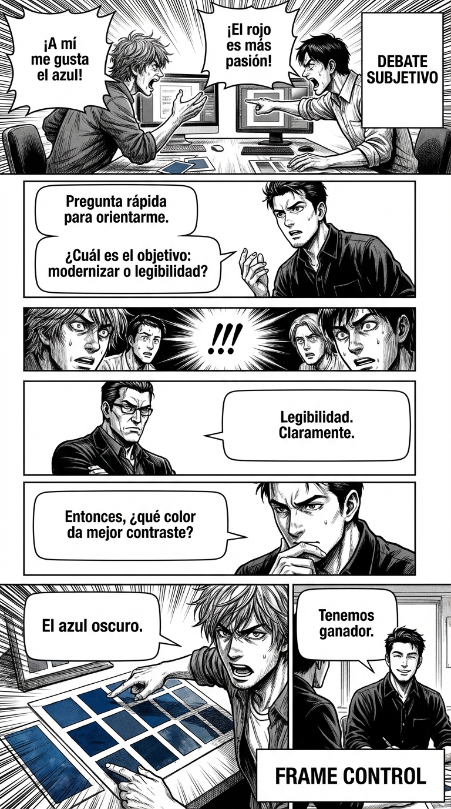

# 2.2 Preguntas que encuadran: liderar desde la duda

> **Objetivo de aprendizaje**: Aprender a usar preguntas estratégicas para definir el propósito de una interacción y obligar a los demás a operar bajo tu marco de referencia.

## Relato

Reunión creativa. El equipo discute sobre el color del logo. Llevan 20 minutos de gustos subjetivos ("a mí me gusta el azul", "pues a mí el rojo"). No hay criterio.

Mike no opina sobre colores. Levanta la mano y lanza lo que parece una duda inocente:

—Perdonad, una pregunta rápida para orientarme. **[Pregunta de Encuadre:]** ¿Cuál es el objetivo principal de este cambio: modernizar la marca o mejorar la legibilidad en móvil?

El equipo se detiene. El debate "azul vs rojo" muere al instante.
—Bueno, legibilidad —dice el jefe—. Claramente.

—Entendido —sigue Mike—. Entonces, **[Consecuencia Lógica:]** ¿qué color nos da mejor contraste en pantallas pequeñas?

—El azul oscuro —dice el diseñador.

—Pues parece que tenemos ganador.

Mike no ha elegido el azul. Ha elegido el *criterio* (legibilidad). Al definir el marco, la respuesta ha caído por su propio peso. Ha liderado sin dar una sola orden.

## Explicación Profunda

El **Control de Marco (Frame Control)** es la habilidad social más potente que existe. El "marco" es la lente a través de la cual interpretamos la realidad. En el relato, el marco inicial era "Gustos Personales" (un marco ingobernable). Mike lo sustituye por el marco "Eficiencia Técnica".

La mejor herramienta para imponer un marco no es una afirmación ("¡tenemos que mirar la legibilidad!"), que puede generar resistencia ("¡no me mandes!"). Es una **pregunta**.
Las preguntas son caballos de Troya. Para responder a tu pregunta, el cerebro del otro debe aceptar las premisas implícitas en ella.

*   Si pregunto: "¿Por qué llegas siempre tarde?", el marco es "Tú eres impuntual y tienes que justificarte".
*   Si pregunto: "¿Qué podemos cambiar para que llegues a hora?", el marco es "Somos un equipo solucionando un problema logístico".

Las **Preguntas que Encuadran** (Framing Questions) traen lo implícito a lo explícito. "¿Cuál es el objetivo aquí?" es la pregunta reina. Obliga a definir el terreno de juego. Quien define las reglas del juego, gana.

## Síntesis de Ideas Clave

*   **Quien pregunta, dirige**: En una interacción, la persona que hace las preguntas está extrayendo valor y dirigiendo la atención. La persona que responde está trabajando para la otra.
*   **La Ilusión de Elección**: Al preguntar "¿Prefieres A o B?", encuadras la realidad en esas dos opciones, haciendo olvidar que quizás existe C.
*   **Enfoque a Objetivo**: Ante la dispersión, la pregunta "¿Cómo ayuda esto a [Objetivo]?" actúa como un láser que corta la grasa.

## Ejemplos Prácticos

### 1. El Cliente Indeciso / Quejoso
*   **Situación**: El cliente da vueltas, pide cambios contradictorios, no está contento con nada.
*   **Acción**: Pregunta por la prioridad.
*   **Frase**: *"Entiendo los matices. **[Pregunta:]** De todas estas cosas, ¿cuál es la única que, si la arreglamos hoy, haría que este proyecto sea un éxito para ti?"*
*   **Por qué funciona**: Le obligas a priorizar. Sales del marco "todo está mal" al marco "arreglemos lo vital".

### 2. El Conflicto de "Quién tiene razón"
*   **Situación**: Discusión doméstica sobre quién dejó la luz encendida. Bucle de culpas.
*   **Acción**: Cambia el marco de Culpabilidad a Solución.
*   **Frase**: *"Espera. **[Pregunta:]** ¿Queremos buscar un culpable o queremos asegurarnos de pagar menos luz el mes que viene?"*
*   **Por qué funciona**: Haces que la búsqueda de culpables parezca infantil e ineficiente. Nadie quiere decir "prefiero buscar un culpable", así que aceptan tu marco de solución.

### 3. La Negociación de Salario
*   **Situación**: Tu jefe dice que no hay presupuesto para subidas.
*   **Acción**: Pregunta por las condiciones de posibilidad.
*   **Frase**: *"Entiendo la restricción actual. **[Pregunta:]** ¿Qué resultados tendría que ver la empresa en los próximos 6 meses para que una subida del 10% sea una inversión obvia y no un gasto?"*
*   **Por qué funciona**: No aceptas el "No". Pides la "receta del Sí". Encuadras tu subida como una "inversión", no un "gasto".

## Señales de Progreso

1.  **Detectas el marco invisible**:
    *   *¿Te das cuenta de cuándo alguien está asumiendo cosas falsas?* ("¿Cuándo vas a sentar la cabeza?" -> Asume que ahora no la tienes sentada).
2.  **No respondes automáticamente**:
    *   *¿Respondes a una pregunta con otra pregunta?* Ante una pregunta trampa, no te justificas. Cuestionas la premisa.
3.  **Claridad grupal**:
    *   *¿Tus preguntas desatascan reuniones?* La gente empieza a mirarte cuando se pierden, esperando tu "pregunta brújula".

## Errores Habituales

*   **Responder a la Pregunta Trampa**
    *   *Se ve así*: "¿Por qué eres tan desordenado?" -> "Es que no tuve tiempo..." (Error: has aceptado que eres desordenado).
    *   *Alternativa*: "¿A qué te refieres con desordenado? Yo veo mi mesa operativa." (Cuestionar la etiqueta).
*   **Preguntas Retóricas Agresivas**
    *   *Se ve así*: "¿Pero tú eres tonto o qué?"
    *   *Resultado*: Guerra. Eso no es Frame Control, es un insulto.
    *   *Alternativa*: Preguntas genuinas de proceso. "¿Qué te llevó a tomar esa decisión?"
*   **Perder el Hilo tras Preguntar**
    *   *Se ve así*: Preguntas por el objetivo, te responden, y no haces nada con la respuesta.
    *   *Alternativa*: Usa la respuesta para cerrar. "Si el objetivo es X, entonces hagamos Y."

## Conclusiones

Tu poder no reside en tener todas las respuestas, sino en hacer las mejores preguntas. Una buena pregunta puede girar un barco enorme (una empresa, una familia) con un pequeño movimiento de timón. Deja de intentar "convencer" con argumentos y empieza a "encuadrar" con curiosidad estratégica.

## Práctica Deliberada

*   **Ficha**: [Juego 3: Re-encuadre Relámpago](../juegos/juego_03.md).
*   **Por qué ayuda**: Practica con un compañero. Él te lanza una acusación ("Eres un egoísta"). Tú tienes que responder con una pregunta que cambie el marco ("¿Cuidar de mis necesidades me hace egoísta o responsable?").

