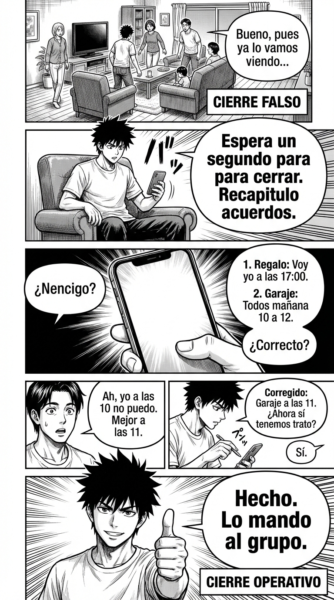

# 2.4 Cierres operativos: acuerdos que se cumplen

> **Objetivo de aprendizaje**: Aprender a finalizar conversaciones indefinidas con acuerdos concretos ("quién hace qué para cuándo"), evitando malentendidos y la sensación de pérdida de tiempo.

## Relato

Viernes, 14:00. Reunión de planificación familiar. Se habla de ir a comprar el regalo para la abuela, de limpiar el garaje y de que falta leche. Todo mezclado.

—Bueno, pues ya lo vamos viendo —dice alguien, levantándose.

Mike no se levanta. Sabe que "ya lo vamos viendo" significa "nadie va a hacer nada y nos pelearemos el domingo".

—Espera un segundo para cerrar —dice Mike, sacando el móvil para anotar—. Recapitulo acuerdos. **[Recuento]**: Uno, voy yo a por el regalo esta tarde a las 17:00. Dos, limpiamos el garaje todos mañana sábado de 10 a 12. Y tres, la leche la compras tú ahora al bajar. ¿Correcto?

—Ah, yo mañana a las 10 no puedo —dice su pareja—. Mejor a las 11.

—Corregido: Garaje a las 11. ¿Ahora sí tenemos trato?

—Sí.

—Hecho. **[Confirmación]**: Lo mando al grupo. Gracias a todos.

El "Cierre Operativo" ha transformado buenas intenciones gaseosas en un plan sólido. Ha sacado a la luz un conflicto oculto (la hora del garaje) que habría estallado mañana.

## Explicación Profunda

El mundo está lleno de "Cierres Falsos": "Ya te llamaré", "Lo vemos", "Hay que hacer algo con esto". Son frases de bajo estatus porque denotan **miedo al compromiso** o falta de claridad.

El líder eficaz es quien **cristaliza** la ambigüedad. El Cierre Operativo (o "Call to Action" claro) es la firma del contrato verbal. Sin él, la reunión ha sido solo ruido.

Elementos del Cierre Operativo Mike:
1.  **Recapitular**: "Resumiendo...". Demuestra escucha activa y valida a los demás.
2.  **Asignar**: Nombre + Verbo + Fecha. (Mike + Regalo + 17:00). La trinidad de la ejecución.
3.  **Verificar**: "¿Correcto?". Pide el "SÍ" explícito. Este "Sí" es un contrato psicológico. Si alguien rompe el acuerdo después, ha roto su palabra, no solo una expectativa vaga.

Esto también funciona para decir NO. Un cierre operativo puede ser: "Acordamos que NO vamos a comprar el regalo este finde". Eso también es un cierre válido porque elimina la incertidumbre.

## Síntesis de Ideas Clave

*   **Claridad es Poder**: La confusión beneficia al manipulador o al vago. La claridad beneficia al ejecutor. Sé el agente de la claridad.
*   **El Rol de Secretario**: Paradójicamente, quien toma notas y resume ("el secretario") tiene mucho poder, porque es quien escribe la historia oficial de lo que se ha decidido.
*   **El Contrato Psicológico**: Al hacer que el otro diga "Sí, estoy de acuerdo", activas el principio de consistencia (Cialdini). Le será mucho más difícil echarse atrás luego.

## Ejemplos Prácticos

### 1. El Cierre de Ventas / Negociación
*   **Situación**: "Bueno, pues ya le daremos una pensada." (Evasiva).
*   **Acción**: Fuerza un siguiente paso concreto.
*   **Frase**: *"Perfecto. Para organizarme: **[Cierre]** ¿os parece bien si os llamo el martes a las 10:00 para ver qué habéis decidido? ¿O preferís miércoles?"*
*   **Por qué funciona**: "Darle una pensada" es infinito. "Martes a las 10" es un hito. Si te dicen "no nos llames", ya tienes tu respuesta (es un No). Ahorras tiempo.

### 2. La Cita Romántica / Social
*   **Situación**: "A ver si quedamos un día de estos."
*   **Acción**: Aterriza o descarta.
*   **Frase**: *"Me encantaría. **[Cierre]** ¿Te va bien este jueves por la tarde para un café? Si no, dime tú cuándo."*
*   **Por qué funciona**: Demuestra interés real y confianza. Si te dan largas de nuevo, sabes que no hay interés real y puedes pasar página (High Value Move).

### 3. La Discusión Circular
*   **Situación**: Lleváis media hora discutiendo lo mismo.
*   **Acción**: "Agree to disagree" (Acordar estar en desacuerdo).
*   **Frase**: *"Veo que no nos vamos a convencer hoy. **[Cierre]** Acordemos que tú votas A, yo voto B, y dejamos el tema por hoy para poder cenar en paz. ¿Trato?"*
*   **Por qué funciona**: El "acuerdo" es dejar de pelear. Es un cierre operativo válido que protege la relación.

## Señales de Progreso

1.  **Agenda limpia**:
    *   *¿Tienes menos "temas pendientes" en la cabeza?* Al cerrar las conversaciones, descargas tu RAM mental. Sabes qué hay que hacer y cuándo.
2.  **Reputación de fiabilidad**:
    *   *¿La gente confía en ti?* Cuando siempre aclaras el "quién hace qué", la gente se siente segura trabajando contigo. Saben que no habrá sorpresas desagradables.
3.  **Detección de humo**:
    *   *¿Te das cuenta rápido de cuando alguien te vende humo?* Cuando pides concreción y te dan largas, tu radar de "pérdida de tiempo" salta.

## Errores Habituales

*   **El Cierre Asumido (Unilateral)**
    *   *Se ve así*: "Vale, pues tú haces eso" (y te vas sin esperar respuesta).
    *   *Resultado*: La otra persona no ha aceptado. No lo hará.
    *   *Alternativa*: Expectar el asentimiento o el "Sí".
*   **Olvidar el "Cuándo"**
    *   *Se ve así*: "Vale, Juan mira el presupuesto."
    *   *Resultado*: Juan lo mirará dentro de 3 meses.
    *   *Alternativa*: "...para el lunes."
*   **Miedo a parecer pesado**
    *   *Se ve así*: No verificas para no molestar.
    *   *Alternativa*: Entender que aclarar no es molestar, es profesionalidad.

## Conclusiones

Una interacción sin cierre es como un libro al que le han arrancado la última página: insatisfactoria e inútil. Acostúmbrate a ser la persona que pone el punto final (o punto y aparte). "Entonces, quedamos así". Esas tres palabras son el pegamento que mantiene unida la vida social y profesional.

## Práctica Deliberada

*   **Ficha**: [Juego: Plantilla 3 Pasos Sprint](../juegos/juego_08.md).
*   **Por qué ayuda**: Revisa tus chats. Busca conversaciones abiertas que se hayan muerto. Resucítalas con un Cierre Operativo: "Hola, esto se quedó pendiente. ¿Lo cerramos para el viernes o lo descartamos?".

