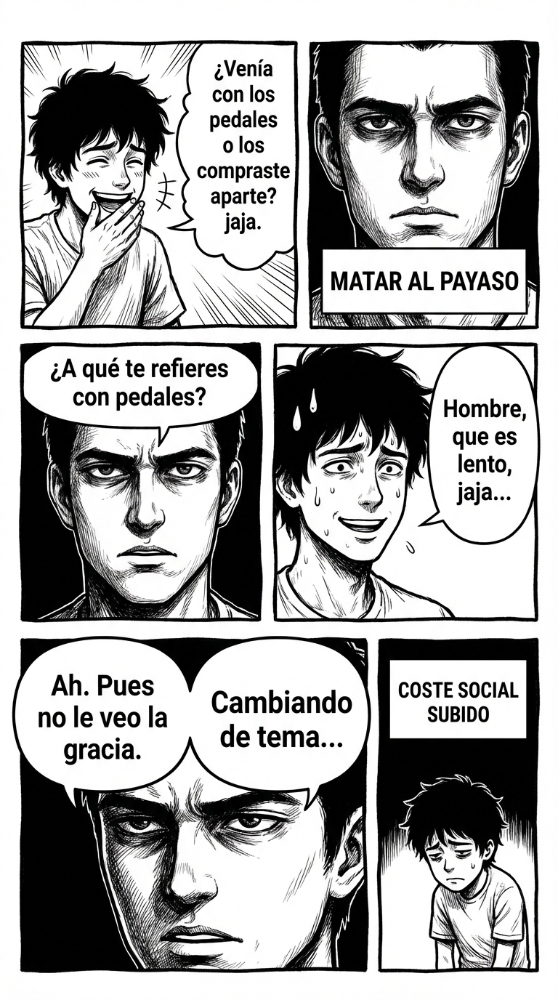

# 4.3 Anti-broma descalificadora: matar al payaso

> **Objetivo de aprendizaje**: Neutralizar la "Broma de Schrödinger" (esa que es broma o insulto según si te enfadas o no) obligando al agresor a definirse.

## Relato

En una cena, un "amigo" dice sobre el nuevo coche de Mike:
—Vaya cacharro te has comprado, ¿no? ¿Venía con los pedales o los compraste aparte? jaja.

En una cena, un "amigo" dice sobre el nuevo coche de Mike:
—Vaya cacharro te has comprado, ¿no? ¿Venía con los pedales o los compraste aparte? jaja.

El grupo ríe nerviosamente. Mike podría ofenderse ("¡Es un buen coche!") o reírse para encajar ("Jaja, sí..."). Ambas opciones le darían el poder al agresor. Mike elige la tercera vía.

Se queda totalmente serio. Silencio de dos segundos que congela las risas.
—**[Pregunta literal:]** ¿A qué te refieres con pedales? —pregunta con curiosidad clínica.

El amigo deja de reír, incómodo.
—Hombre, que es lento, jaja. Era una broma.

—Ah. **[Seriedad:]** Pues a mí me gusta y me lleva. No le veo la gracia a reirse de él.

—Jo, qué sensible...

—**[Límite:]** Ya. Pues no ha tenido gracia. Cambiando de tema...

Mike ha convertido el chiste en un momento incómodo para el gracioso, subiendo el coste social de la falta de respeto.

## Explicación Profunda

La **Broma Descalificadora** es el arma favorita del agresor pasivo. Se esconde tras el escudo de "es humor".
Para desactivarla, tienes que negarles el premio (tu risa o tu enfado) y darles un castigo (incomodidad social).

Técnicas:
1.  **Literalidad Absoluta**: Trata la broma como una frase seria. Obliga a explicarla. "No lo pillo, ¿me lo explicas?". Explicar un chiste destruye el humor.
2.  **El Silencio Incómodo**: Mírale como si tuviera un moco colgando. No digas nada. Deja que su risa se apague sola en el vacío.
3.  **La Etiqueta Directa**: "Eso no suena a broma, suena a ataque".

El objetivo es subir el **Coste Social** de meterse contigo. Si cada vez que hacen un chiste a tu costa se crea un silencio sepulcral, dejarán de hacerlo porque no reciben la dopamina de la risa grupal.

## Síntesis de Ideas Clave

*   **Schrödinger's Douchebag**: Alguien que decide si estaba bromeando o no basándose en tu reacción. No les dejes elegir. Defínelo tú como "falta de respeto".
*   **Control del Humor**: El líder decide de qué nos reímos. No te rías por compromiso. Tu risa es valiosa, dásela solo a quien te respeta.
*   **Romper el Marco de Juego**: Ellos están en marco "Jiji Jaja". Tú cambias a marco "Serio/Adulto". El contraste les deja helados.

## Ejemplos Prácticos

### 1. Broma sobre el físico
*   **Situación**: "Te estás poniendo fondón, ¿eh?"
*   **Acción**: Acuerdo amplificado o Corte seco.
*   **Corte Seco**: *"Comentarios sobre mi cuerpo: No, gracias."* (Simple y directo).
*   **Acuerdo Amplificado** (High Level): *"Sí, estoy cultivando la curva de la felicidad. Se vive mejor aquí."* (Te apropias del marco y le quitas hierro, pero requiere mucha confianza).

### 2. Broma sobre la competencia profesional
*   **Situación**: "¿Seguro que sabes encender el ordenador? Jaja".
*   **Acción**: Literalidad.
*   **Frase**: *"Sí, sé encenderlo. ¿Necesitas ayuda con algo o solo querías hacer el chiste?"*
*   **Por qué funciona**: Le llamas la atención sobre la inutilidad de su comentario.

### 3. Broma sexista/racista
*   **Situación**: Chiste ofensivo general.
*   **Acción**: El "No lo pillo".
*   **Frase**: *"No lo entiendo. ¿Por qué es gracioso que [X]?"*
*   **Por qué funciona**: Obligas a verbalizar el prejuicio. "Bueno, es que las mujeres son..." -> Ahí se retratan solos y quedan fatal.

## Señales de Progreso

1.  **No sonríes por reflejo**:
    *   *¿Controlas tu cara?* Has dejado de usar la sonrisa de apaciguamiento cuando te sientes atacado.
2.  **Disfrutas del silencio**:
    *   *¿Aguantas la tensión?* Cuando matas la broma, hay tensión. En lugar de huir de ella, la usas para disciplinar.
3.  **Respeto grupal**:
    *   *¿Se ríen contigo, no de ti?* La gente aprende que contigo se puede bromear, pero no faltar. El nivel del humor sube.

## Errores Habituales

*   **Enfadarse ("¡No tiene gracia!")**
    *   *Se ve así*: Gritas y te vas.
    *   *Resultado*: "Qué amargado". Ellos ganan el marco de "somos divertidos y tú no".
    *   *Alternativa*: Aburrimiento. "Vaya chiste más malo."
*   **Contraatacar ("¡Pues tú eres feo!")**
    *   *Se ve así*: Insulto infantil.
    *   *Resultado*: Pelea de barro.
    *   *Alternativa*: Superioridad indiferente.

## Conclusiones

El humor es maravilloso, pero el humor agresivo es veneno. Ten un radar fino. Si te hace sentir pequeño, no es humor, es jerarquía. Y ante la jerarquía abusiva, la respuesta es la rebelión calmada. Mata al payaso triste.

## Práctica Deliberada

*   **Ficha**: [Juego 4: Broma o Descalificación](../juegos/juego_04.md).
*   **Por qué ayuda**: Entrena el "No lo pillo" con amigos de confianza. Verás lo difícil que es explicar un chiste sin parecer tonto.

