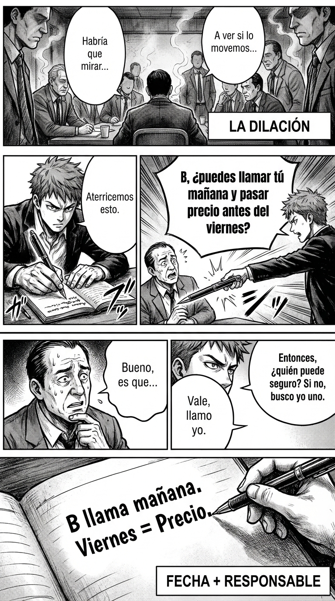

# 4.4 Anti-dilación: fecha + responsable o muerte

> **Objetivo de aprendizaje**: Evitar los compromisos vagos ("ya veremos", "intentaré hacerlo") exigiendo siempre concreción absoluta para evitar decepciones y pérdidas de tiempo.

## Relato

Reunión de vecinos para arreglar la puerta. El ambiente es de buena voluntad pero nula ejecución. El Vecino A sugiere "mirar presupuestos", y el Vecino B comenta vagamente que "conoce a uno" y que ya le llamará. El Vecino C remata con un clásico: "A ver si lo movemos la semana que viene".

Mike ve la trampa de la **[Dilación]**: si se levantan ahora, la puerta seguirá rota en Navidad. Interviene con precisión quirúrgica.
—Aterricemos esto —dice, sacando el móvil—. **[Anti-dilación:]** Vecino B, ¿puedes llamar a tu contacto *mañana* y pasarnos el precio antes del viernes?

El Vecino B duda, incómodo ante el compromiso real: "Bueno, es que estoy liado...".

Mike no acepta la excusa. Aplica la presión de la alternativa:
—Entendido. Entonces, ¿quién puede hacerlo seguro antes del viernes? Si nadie puede, busco yo uno en Google ahora mismo y aceptamos ese precio.

El Vecino B reacciona rápido para no perder control: "Vale, vale, llamo yo mañana".
—Perfecto —cierra Mike—. **[Acta Oral:]** Anotado: B llama mañana, viernes tenemos precio en el grupo. Gracias a todos.

Mike ha transformado deseos gaseosos en ladrillos sólidos de acción.

## Explicación Profunda

La **Ley de Parkinson** dice que el trabajo se expande hasta llenar el tiempo disponible. Si el tiempo disponible es "infinito" (sin fecha), el trabajo nunca se hace.
La gente usa la dilación ("ya iré viendo") para evitar el dolor del esfuerzo o el compromiso.
Si permites dilación, te conviertes en cómplice de la ineficacia.

El remedio es el **Cierre CPS (Capítulo 1.5)** aplicado con rigor militar.
1.  **Responsable Único**: "Nosotros lo miramos" = Nadie lo mira. Tiene que ser "Juan lo mira".
2.  **Fecha Límite (Deadline)**: "La semana que viene" no existe. "El martes a las 12:00" existe.
3.  **Consecuencia del Incumplimiento**: "¿Qué pasa si no está?". (Plan B).

Esto te convierte en alguien de "Alto Rendimiento". La gente aprende que si te prometen algo, tú lo vas a apuntar y lo vas a reclamar.

## Síntesis de Ideas Clave

*   **Accountability (Rendición de cuentas)**: Es la base de la confianza. Hacer lo que dijiste que harías. Exigir lo mismo a los demás no es ser pesado, es ser profesional.
*   **El Poder del Escriba**: Escribir el acuerdo delante de todos ("Tomo nota: Juan, martes") tiene un poder mágico. Lo escrito es ley.
*   **SMART**: Específico, Medible, Alcanzable, Relevante, Temporal. Aplica esto a cada micro-acuerdo.

## Ejemplos Prácticos

### 1. El Amigo que dice "a ver si nos vemos"
*   **Situación**: Dilación social eterna.
*   **Acción**: Fuerza fecha o descarta.
*   **Frase**: *"Sí, tengo ganas. **[Fecha]** ¿Te va bien martes o jueves cena? Si estás muy liado ahora, me avisas tú cuando tengas hueco real."*
*   **Por qué funciona**: Le obligas a comprometerse o a admitir que no tiene hueco (y dejas de perseguirle).

### 2. El Proveedor que se retrasa
*   **Situación**: "Estamos en ello..."
*   **Acción**: Pide fecha firme.
*   **Frase**: *"Necesito una fecha de entrega garantizada para organizarme. ¿Cuándo va a estar al 100%? Si no podéis cumplir fecha, decídmelo ya para buscar alternativa."*
*   **Por qué funciona**: La amenaza de "buscar alternativa" rompe la inercia.

### 3. Tareas Domésticas
*   **Situación**: "Ya bajaré la basura luego."
*   **Acción**: Define "luego".
*   **Frase**: *"¿Antes de cenar o después de cenar? Necesito saberlo para no estar pendiente."*
*   **Por qué funciona**: "Estar pendiente" es carga mental. Al fijar momento, te liberas.

## Señales de Progreso

1.  **Agenda real**:
    *   *¿Tu calendario tiene bloques concretos?* Sabes qué va a pasar. La incertidumbre baja.
2.  **Reputación de "Killer"**:
    *   *¿Te llaman "organizado"?* A veces te llamarán "intenso", pero siempre contarán contigo cuando haya que hacer algo de verdad.
3.  **No persigues**:
    *   *¿Dejas caer lo que no tiene fecha?* Si alguien no te da fecha, asumes que no va a pasar y te olvidas. Ahorras energía.

## Errores Habituales

*   **Aceptar "Lo antes posible" (ASAP)**
    *   *Se ve así*: "Mándamelo ASAP".
    *   *Resultado*: Para ti es 1 hora, para él es 3 días. Conflicto asegurado.
    *   *Alternativa*: "Mándamelo antes de las 17:00".
*   **Dar por hecho**
    *   *Se ve así*: "Bueno, ya sabe él que tiene que hacerlo".
    *   *Resultado*: No lo sabe (o se hace el tonto).
    *   *Alternativa*: Confirmación explícita.
*   **Ser un tirano**
    *   *Se ve así*: Exigir fechas imposibles.
    *   *Alternativa*: Negociar la fecha. "¿Cuándo es realista para ti? ¿Viernes? Venga, viernes entonces, pero viernes seguro."

## Conclusiones

La dilación es el ladrón del tiempo. El antídoto es la precisión. Sé preciso con tu palabra y exige precisión a los demás. La vida es demasiado corta para vivir esperando llamadas que nunca se concretaron.

## Práctica Deliberada

*   **Ficha**: [Juego 8: Plantilla 3 Pasos Sprint](../juegos/juego_08.md).
*   **Por qué ayuda**: Practica cerrar cada mensaje con un "Siguiente paso" que tenga fecha y hora. Revisa tus últimos 5 emails. ¿Tienen fecha?

