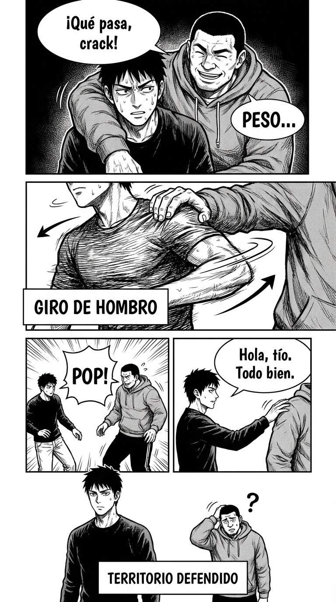

# 4.5 Tocar sin permiso: defensa territorial

> **Objetivo de aprendizaje**: Aprender a leer los toques físicos (brazo, hombro, espalda) como señales de estatus y rechazarlos si no son bienvenidos, restableciendo tu autonomía corporal.

## Relato

En un bar, un conocido se acerca a Mike y le pasa el brazo por el cuello, apretando un poco. Es un gesto de "falsa camaradería" que en realidad sirve para inmovilizarle y marcar estatus.
—¡Qué pasa, crack! —dice el tipo, dejándole caer todo su peso.

Mike sabe que si se queda ahí doblado, se convierte en la mascota del grupo. Pero no quiere pelear. Ejecuta una defensa en tres tiempos.
Primero, **[Aikido Físico]**: gira sus hombros 90 grados hacia el tipo. Por simple mecánica, el brazo del invasor resbala y cae al perder su punto de apoyo.

Al instante, Mike da medio paso atrás para **[Restablecer Distancia]** y recuperar su burbuja personal.

Ya liberado y de pie frente a él, Mike extiende la mano o le da una palmada en el brazo, pero esta vez desde la verticalidad.
—Hola, tío. Todo bien. —Su voz es neutra, sin la risa nerviosa que el otro esperaba.

El tipo ha perdido su "agarre" literal y figurado. Mike está libre.

## Explicación Profunda

El contacto físico (haptics) es el lenguaje más primitivo del poder. En los primates, el alfa acicala o golpea a los subordinados a placer.
En humanos:
*   **Toque Alto (Hombro/Cuello)**: Paternalista o Dominante. ("Buen chico").
*   **Toque Bajo (Espalda)**: Guía o Empuje. ("Pasa por ahí").
*   **Agarrar**: Control.

Si alguien te toca y tú no le tocas (asimetría), él tiene más estatus.
Si te toca sin permiso y tú te congelas, te sometes.
La regla es: **Tu cuerpo es territorio soberano**. Nadie entra sin visado.

Estrategias:
1.  **Reciprocidad**: Si te toca el hombro, tócale tú el hombro igual. Iguala el marcador.
2.  **Retirada**: Mueve la parte del cuerpo tocada fuera de su alcance. Sutil pero claro.
3.  **Bloqueo**: Pon tu mano en medio.

## Síntesis de Ideas Clave

*   **Haptics y Estatus**: Quien inicia el toque suele tener más poder... a menos que el toque sea rechazado. Rechazar un toque es un "Power Move" masivo.
*   **La Burbuja Personal**: Tienes derecho a un espacio de 50-100 cm alrededor de ti. Defenderlo no es ser "raro", es tener dignidad.
*   **Escalada Física**: Si permites un toque pequeño no deseado, vendrán toques mayores. Corta pronto.

## Ejemplos Prácticos

### 1. El Jefe que masajea los hombros
*   **Situación**: Invasión clásica y espeluznante. Te viene por detrás y te aprieta los trapecios.
*   **Acción**: Bloqueo inmediato.
*   **Frase/Gesto**: Levanta tus hombros hacia las orejas (bloqueando sus manos) y gira la silla rápido. *"Me haces cosquillas / No me va el masaje, gracias."* (Dicho serio).

### 2. El "Date la vuelta" (Toque en la espalda)
*   **Situación**: Alguien te toca la espalda para que te apartes.
*   **Acción**: No te muevas por resorte. Gira la cabeza lentamente.
*   **Reacción**: Mírale, evalúa, y luego muévete si quieres. No seas un autómata que salta cuando le tocan el botón.

### 3. El Apretón de Manos Rompe-Huesos
*   **Situación**: Te aprieta la mano a lo bestia para demostrar que es muy macho.
*   **Acción**: No compitas en fuerza. Métete en su zona.
*   **Técnica**: Da un paso adelante, invadiendo su espacio íntimo mientras te aprieta. Eso le incomodará a él. Y dile: *"Fuerte agarre, sí señor."* (Sarcasmo suave: "veo lo que haces").

## Señales de Progreso

1.  **Instinto de esquiva**:
    *   *¿Te apartas fluido?* Como un boxeador. Ves la mano venir y te mueves suavemente para que no aterrice.
2.  **No te quedas congelado**:
    *   *¿Reaccionas?* Ya no aguantas 10 minutos con una mano sudorosa en tu hombro por vergüenza a quitarla.
3.  **Tocas tú también**:
    *   *¿Usas el toque para conectar?* Aprendes a usar el toque positivo (apretón firme, leve toque en antebrazo) para generar confianza, no dominio.

## Errores Habituales

*   **Apartar la mano con asco**
    *   *Se ve así*: Un manotazo brusco. "¡Quita bicho!"
    *   *Resultado*: Pareces histérico/agresivo.
    *   *Alternativa*: Movimiento corporal fluido (girarse, dar un paso). Parece accidental pero es intencional.
*   **Sonreír mientras sufres**
    *   *Se ve así*: Él te espachurra, tú sonríes.
    *   *Alternativa*: Cara de póker o leve ceño fruncido.

## Conclusiones

Tu piel es la última frontera. Si no defiendes tu piel, tu mente entiende que eres indefenso. Al reclamar tu espacio físico, envías una señal poderosa a tu subconsciente: "Yo mando aquí". Y los demás lo notan.

## Práctica Deliberada

*   **Ficha**: [Juego 11: Tocar No Es Gratis](../juegos/juego_11.md).
*   **Por qué ayuda**: Practica las "salidas de llave". Que un amigo te agarre del brazo y practica soltarte girando la muñeca o girando el cuerpo sin usar fuerza bruta. Aikido social.

