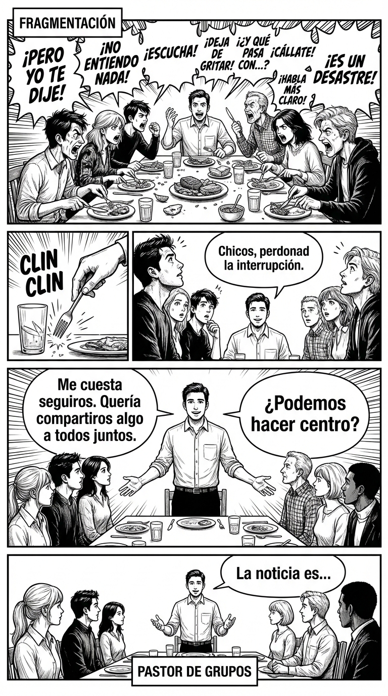

# 4.7 Grupo: reglas para la jungla

> **Objetivo de aprendizaje**: Manejar las conversaciones múltiples cuando el grupo se desmadra, estableciendo reglas implícitas o explícitas que pongan orden sin parecer un dictador.

## Relato

Cena de amigos, 8 personas. Se han formado 3 sub-conversaciones a gritos. Nadie se entera de nada. El ruido es insoportable. Mike quiere contar una noticia importante, pero sabe que si habla flojo nadie le oirá, y si grita "¡CALLAOS!" parecerá un amargado.

Mike opta por la **[Escalada de Atención]**.
Primero, actúa desde lo **Físico**: se pone de pie y golpea suavemente su copa con el tenedor (*clin, clin*). El sonido agudo corta el murmullo mejor que un grito.

Espera un segundo a que las miradas converjan en él (**Silencio pre-verbal**) y sonríe con calidez, no con enfado. Entonces lanza el **[Encuadre de Unión]**:
—Chicos, perdonad la interrupción. Me está costando seguiros con tanto lío y quería compartiros algo a todos juntos. ¿Podemos hacer centro un minuto?

El grupo, aliviado por el orden, se calla.
—Gracias. La noticia es...

Mike ha unificado el grupo apelando a la unidad ("a todos juntos"), no a la obediencia.

## Explicación Profunda

Los grupos grandes tienden a la **Fragmentación**. En cuanto hay más de 4 personas, la conversación única se rompe.
El líder es la fuerza **Centrípeta**: atrae la energía hacia el centro.
Para hacerlo, necesitas:
1.  **High Energy**: Tienes que tener un nivel de energía ligeramente superior a la media del grupo para captar la atención.
2.  **Señal de Foco**: Algo que rompa el patrón (ponerse de pie, un ruido, un gesto amplio).
3.  **Inclusión**: Tu mensaje debe ser relevante para *todos*. Si pides silencio para hablar solo con uno, el grupo te odiará.

Otra regla clave es la **Defensa del Orador Débil**. Si alguien intenta hablar y el grupo lo ignora, el líder interviene: "Esperad, que María estaba diciendo algo. María, dale". Esto te da autoridad moral masiva.

## Síntesis de Ideas Clave

*   **Fragmentación vs. Unificación**: El estado natural es el caos. El estado de liderazgo es el orden. Unificar el foco es un servicio al grupo.
*   **Warmth (Calidez)**: Al pedir silencio, hazlo con una sonrisa ("venga chicos"). Si lo haces serio ("¡silencio!"), pareces la señorita Rottenmeier.
*   **Gatekeeper (El Portero)**: Tú decides quién entra y quién sale de la conversación. "Espera Pedro, deja acabar a Juan".

## Ejemplos Prácticos

### 1. La "Coña" que no para
*   **Situación**: El grupo ha entrado en bucle de risas y no se avanza en la decisión (ej: elegir restaurante).
*   **Acción**: El "Bueno" de cierre.
*   **Frase**: *"Bueno... (Pausa, tono descendente). Nos hemos reído mucho. Ahora, ¿sushi o pizza?"*
*   **Por qué funciona**: La palabra "Bueno" dicha con tono grave y pausa señala fin de recreo.

### 2. Dos personas monopolizan la mesa
*   **Situación**: A y B hablan de su trabajo y los otros 4 miran.
*   **Acción**: Ampliar el círculo.
*   **Frase**: *"Oye, eso suena como lo que le pasó a Carla el otro día. Carla, ¿tú qué opinas?"*
*   **Por qué funciona**: Usas el tema de A y B para lanzar un pase a Carla. Has re-integrado al grupo.

### 3. El grupo te ignora
*   **Situación**: Empiezas a hablar y nadie te escucha.
*   **Acción**: No sigas hablando (es patético). Para.
*   **Técnica**: Toca el brazo de la persona alfa del grupo. "Oye Luis, escucha esto". Cuando Luis te mire, el resto le seguirá.
*   **Por qué funciona**: Hackeas la jerarquía. Si el líder te escucha, el grupo te escucha.

## Señales de Progreso

1.  **Centro de gravedad**:
    *   *¿Las miradas van a ti cuando hay dudas?* En los silencios, la gente te mira para ver qué pasa ahora. Eres el director de orquesta.
2.  **Menos gritos**:
    *   *¿Consigues atención sin gritar?* Usas el silencio, los gestos o el "clin clin" en lugar del volumen.
3.  **Protector**:
    *   *¿La gente tímida se te acerca?* Saben que en tu grupo tendrán turno de palabra garantizado.

## Errores Habituales

*   **Hablar por encima del ruido**
    *   *Se ve así*: Gritar tu anécdota mientras otros hablan.
    *   *Resultado*: Ruido blanco. Nadie te oye y pareces desesperado.
    *   *Alternativa*: Espera al silencio o créalo.
*   **Ser el policía**
    *   *Se ve así*: "¡Sshhh! ¡Callaos!"
    *   *Resultado*: Rebelión.
    *   *Alternativa*: "Chicos, un segundo..." (Tono colegueo).

## Conclusiones

Los grupos son bestias salvajes. Si les tienes miedo, te comen. Si intentas enjaularlos, te muerden. Si los guías con firmeza y diversión, te siguen. Sé el pastor, no el lobo, ni la oveja.

## Práctica Deliberada

*   **Ficha**: [Juego 9: Aterrizaje de Grupo](../juegos/juego_09.md).
*   **Por qué ayuda**: Entrena el momento crítico de "tomar el micro" en medio del caos.

