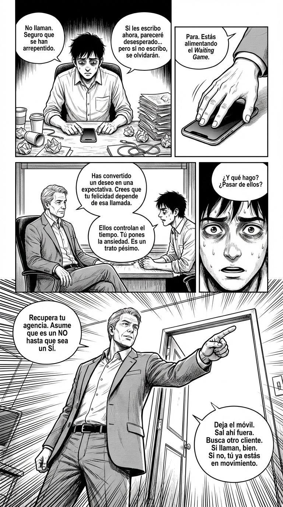

# 4.8 El Waiting Game

> **Objetivo de aprendizaje**: Aprender a identificar cuando alguien usa el tiempo y la incertidumbre para controlarte, y cómo recuperar tu agencia evitando que el deseo se convierta en expectativa.

## Relato

Alex lleva tres días pegado al teléfono. El lunes tuvo una reunión "brillante" con un cliente potencial que prometió enviar el contrato firmado "lo antes posible". Es miércoles por la tarde y hay silencio de radio. Alex no se concentra, revisa el email compulsivamente y empieza a dudar de su propia oferta.

—No entiendo —dice Alex, tamborileando los dedos—. Parecían entusiasmados. ¿Debería llamar otra vez?

Mike niega con la cabeza, tranquilo.
—Si llamas ahora, confirmas tu **[Bajo Estatus]**. Estás en medio de un *Waiting Game*.

—¿Un juego? —Alex se eriza—. Simplemente estarán liados.

—Quizá —dice Mike—. Pero el efecto es el mismo. Ellos controlan el tiempo, tú pones la ansiedad. **[Diagnóstico:]** Has firmado un contrato psicológico invisible: tú estás "dentro" esperando, y ellos siguen "fuera" decidiendo. Esa asimetría te está matando.

—¿Y qué hago? ¿Esperar sentado? —Alex está a la defensiva.

—Al revés. Dejas de esperar. —Mike se inclina—. Ahora mismo sufres porque has convertido un **deseo** ("quiero ese contrato") en una **expectativa** ("necesito que llegue ya"). **[Acción:]** Rompe la expectativa. Ponte una hora límite mental: si no llega a las 18:00, hoy asumes que es un NO y te pones a buscar otro cliente.

Alex parpadea. La idea de "asumir el NO" le aterra, pero de repente, siente que recupera el aire.
—Si asumo que es NO... ya no tengo que vigilar el móvil.

—Exacto. Recuperas tu **[Locus de Control]**. Y paradójicamente, cuando dejas de emitir esa "necesidad", tu tono cuando finalmente hablen será de igual a igual, no de suplicante.

## Explicación Profunda

El **Waiting Game** no consiste simplemente en "hacer esperar". Es una táctica de **control del tempo** que funciona retirando ritmo, feedback y cierre. Quien marca los tiempos, marca la jerarquía de la interacción.

El mecanismo psicológico que lo hace tan efectivo (y doloroso) es puramente **dopaminérgico**. La incertidumbre intermitente ("¿responderá ahora?", "¿y ahora?") genera mucho más enganche mental que un "No" rotundo. Nuestro cerebro está diseñado para resolver patrones incompletos, por lo que entras en un bucle de **rumiación**. Piensas más en ellos, inviertes más energía cognitiva y, por la falacia del costo hundido ("ya he sufrido tres días, tiene que valer la pena"), acabas dispuesto a aceptar peores condiciones con tal de obtener el alivio del cierre.

El error fundamental que comete la "víctima" del Waiting Game es confundir **deseo** con **expectativa**.
*   **Deseo**: "Me interesa que esto ocurra". Es sano, te mueve a la acción.
*   **Expectativa**: "Cuento con que esto ocurra y mi bienestar depende de ello". Es tóxico, te paraliza.

Cuando estás esperando, tu **locus de control** se desplaza hacia fuera. Tu estado de ánimo depende de una notificación en una pantalla. Eso comunica implícitamente una señal de baja jerarquía: "el importante no tiene prisa; el que espera es el que tiene la necesidad".

La paradoja final es cruel: **cuanta más expectativa proyectas, menos atractivo y poder tienes**. La desesperación se huele, y el *Waiting Game* se alimenta de tu espera. La única forma de ganar es no jugar: mantener el deseo pero matar la expectativa mediante límites internos estrictos.

## Síntesis de Ideas Clave

*   **Asimetría de la Espera**: El que espera vive en incertidumbre; el que hace esperar mantiene el control narrativo.
*   **La Trampa de la Expectativa**: El dolor no viene de querer algo, sino de *necesitar* que ocurra en un tiempo que no controlas.
*   **Contrato Invisible**: Evita invertir emocionalmente ("estar dentro") antes de que haya hechos reales. Mantente "fuera" hasta que haya firma.

## Ejemplos Prácticos

### 1. El Silencio del Reclutador (Entorno Profesional)
*   **Situación**: Hiciste una entrevista el viernes, te dijeron "te decimos algo pronto" y es martes.
*   **Acción**: Ponte un "Hard Close" interno.
*   **Frase**: (Diálogo interno) *"Si no llaman para el miércoles a las 12:00, asumo que me han descartado y sigo enviando CVs. No reservo mi esperanza para ellos."*
*   **Por qué funciona**: Te permite seguir operando en el mercado. Si llaman el jueves, será una sorpresa agradable, no un rescate vital.

### 2. El "Visto" sin respuesta (Entorno Social/Citas)
*   **Situación**: Escribes a alguien que te gusta. Lo lee. No contesta en horas.
*   **Acción**: Retira la atención. No escribas "doble check".
*   **Frase**: (Acción conductual) *Dejar el móvil en otra habitación y ponerte a hacer algo que te apasione o te dé dinero.*
*   **Por qué funciona**: Al no insistir, comunicas que tu tiempo es valioso y que no estás pendiente. Rompes el ciclo de validación externa.

### 3. La Promesa Familiar Vaga
*   **Situación**: Un familiar promete "ayudarte con la mudanza" pero no concreta hora.
*   **Acción**: Convierte la espera en plan alternativo.
*   **Frase**: *"Como no me has confirmado hora, he asumido que no podías y he llamado a un amigo. No te preocupes, nos vemos otro día."*
*   **Por qué funciona**: Recuperas la logística de tu vida. No te quedas bloqueado esperando su "favor".

## Señales de Progreso

1.  **Menos Rumiación**: ¿Eres capaz de enviar un mensaje importante y olvidarte de él a los 5 minutos? Eso es poder.
2.  **Criterios de Salida**: ¿Tienes un "reloj interno" que dice "si no X en tiempo Y, hago Z"? Tener un plan B automático te inmuniza contra la espera.
3.  **Foco Recuperado**: ¿Tu bienestar depende de lo que haces tú ahora mismo, o de lo que podría hacer otro luego? Si estás centrado en tu acción, vas ganando.

## Errores Habituales

*   **Pedir "Reaseguro" (Reassurance)**
    *   *Se ve así*: "¿Os llegó mi correo?", "¿Sigues ahí?", "¿Está todo bien?".
    *   *Alternativa*: Silencio. Si les interesa, contestarán. Si no, tu insistencia solo baja tu valor.
*   **Justificar al otro**
    *   *Se ve así*: "Seguro que se le ha roto el móvil", "Estará muy ocupado".
    *   *Alternativa*: Juzgar los hechos. "No ha contestado". Punto.
*   **Sobre-invertir (Coste Hundido)**
    *   *Se ve así*: "Ya he esperado dos semanas, no voy a rendirme ahora".
    *   *Alternativa*: "He perdido dos semanas. Corto la sangría hoy."

## Conclusiones

La regla de oro para derrotar el *Waiting Game* es simple pero difícil de ejecutar: **tu deseo no debe convertirse en expectativa**. Puedes desear el trabajo, la cita o el acuerdo, pero no debes *esperarlo* sentado. Mantente en movimiento. Quien tiene opciones, no espera. Y quien no espera, no puede ser controlado.

## Práctica Deliberada

*   **Ficha**: [Juego 5: No + Alternativa](../juegos/juego_05.md) (Adaptado).
*   **Por qué ayuda**: Aunque el juego 5 va de decir "No", la mecánica subyacente es tener opciones. Practica decirte "No" a ti mismo: "No voy a mirar el móvil en 2 horas". Entrena tu resistencia a la dopamina inmediata.

## Referencias

*   [The Power Moves: Waiting Games](https://thepowermoves.com/waiting-games/) (Concepto general de control de tiempo).
*   [Stop Caring What Others Think](https://thepowermoves.com/stop-caring-what-others-think/): Recuperar el locus de control interno.
