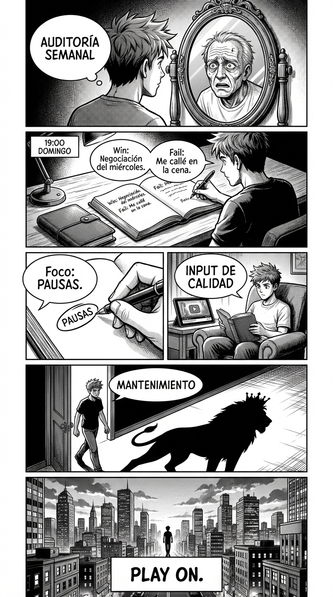

# 5.3 Ritual semanal: el mantenimiento del poder

> **Objetivo de aprendizaje**: Establecer un sistema de revisión periódica para asegurar que las habilidades no se oxidan y seguir progresando indefinidamente.

## Relato

Mike ha terminado los 30 días. Se siente transformados, pero sabe que el "Viejo Mike" (inseguro, complaciente) sigue vivo en su cerebro, esperando un momento de debilidad para volver. La entropía siempre gana si no hay mantenimiento.

Por eso, Mike instituye el **Ritual del Domingo**. 
A las 19:00, se sienta 15 minutos con su cuaderno. Primero, **[Audita]** su semana: "¿Dónde regalé mi poder? ¿Dónde lo defendí?". Luego, elige su **[Foco]** para la siguiente: "Esta semana voy a centrarme solo en las PAUSAS". Finalmente, inyecta **[Inspiración Técnica]**: ve un análisis de vídeo de TPM para afilar su ojo clínico.

Es su "Gimnasio Social". Igual que levanta pesas para no perder músculo, hace esto para no perder carácter.

## Explicación Profunda

El desarrollo personal no es un evento ("hice un curso"), es un proceso ("soy una persona que entrena").
Las habilidades sociales son perecederas. Si dejas de practicar el "No limpio", volverás a dar explicaciones en dos meses.
La única forma de evitar la entropía es el **Ritual**.

Tu sistema de mantenimiento debe incluir:
1.  **Autoconsciencia (Journaling)**: Escribir tus interacciones te ayuda a procesarlas objetivamente.
2.  **Práctica Incomoda (Exposure)**: Buscar activamente situaciones que te den miedo (negociar, hablar en público) para mantener el callo duro.
3.  **Input de Calidad**: Leer a gente como Lucio Buffalmano (TPM), Robert Greene, Cialdini. Mantener el cerebro alimentado de estrategia.

## Síntesis de Ideas Clave

*   **Identity Shift**: El objetivo final no es "hacer" cosas de poder, es "ser" una persona de poder. Cuando se vuelve inconsciente, has ganado.
*   **Kaizen**: Mejora continua. 1% mejor cada semana. En un año eres irreconocible.
*   **El Poder es Servicio**: Recuerda, acumulas poder no para abusar, sino para ser más útil, proteger a los tuyos y hacer avanzar las cosas buenas. El poder sin propósito es vacío.

## El Plan de Mantenimiento (La Ficha)

Copia esto en tu agenda recurrente:

**Domingo - Auditoría de Estatus**
1.  **Top Win**: ¿Cuál fue mi mejor jugada esta semana? (Celébrala).
2.  **Top Fail**: ¿Dónde me achiqué? (Analiza el porqué sin culpa).
3.  **Foco Next**: ¿Qué capítulo del Ebook voy a releer y practicar lunes y martes?

## Conclusiones del Ebook

Has llegado al final.
Empezaste aprendiendo a mirar a los ojos (Día 4) y has acabado aprendiendo a controlar el marco de realidad de una sala entera (Día 30).
El viaje del "Dummy" al "Player" es el viaje de la victimización a la responsabilidad.
Ya no puedes decir "es que me hacen...". Ahora sabes que tú permites o prohibes. Tú encuadras. Tú decides.

El mundo es un lugar duro, pero también fascinante. Juega bien. Juega limpio. Y gana.

Un abrazo de poder.

