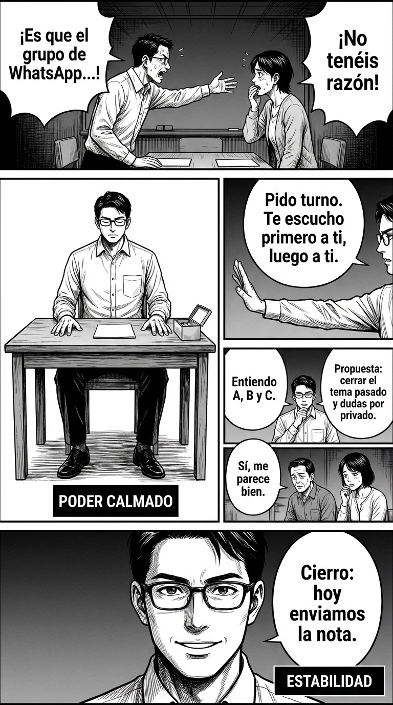

# Día 4 — Cuerpo que sostiene la voz (postura, mirada, gestos)

> **Objetivo de aprendizaje**: Aprender a proyectar seguridad y autoridad a través de señales no verbales conscientes, alineando tu cuerpo con tu mensaje para evitar incoherencias que minen tu estatus.

## Relato

En la tutoría, el ambiente viene tenso. Dos familias discrepan por un malentendido en el grupo de WhatsApp. Mike entra, apoya ambos pies, hombros abiertos, barbilla nivelada. No invade, pero tampoco se encoge.

—Gracias por venir. Empiezo por el objetivo —dice sin prisa—: entender qué pasó y acordar cómo seguir.

Mientras hablan, Mike mantiene **[mirada estable]** (no fija, no huidiza), **[gestos económicos]** y manos visibles sobre la mesa. Cuando uno de los padres acelera y sube el tono, él disminuye el propio. Cuando la madre duda, él asiente suavemente una sola vez, sin cabeceos nerviosos. Cuando ambos se interrumpen:

—Pido turno para cada uno. Te escucho primero a ti; luego a ti —señala con la **[palma abierta]**, no con el dedo.

El ritmo baja. Aparecen matices. Mike resume: —Entiendo A, B y C. Propuesta: cerrar el tema pasado con una nota conjunta y, hacia delante, regla simple: dudas por privado antes de escribir al grupo. ¿Os parece?

Se miran, menos rígidos. —Sí, me parece.

—Cierro: hoy enviamos la nota; si vuelve a haber ruido, nos sentamos otra vez.

## Explicación Profunda

La comunicación no verbal es el "sistema operativo" sobre el que corren tus palabras. Si el sistema es inestable, la mejor aplicación (el mejor argumento) fallará. En situaciones de conflicto, nuestro cerebro reptiliano busca inconscientemente señales de amenaza o sumisión en el otro. Si detecta nerviosismo (movimientos rápidos, mirada huidiza, hombros encogidos), te clasificará como "presa" o "debilidad", y es probable que te interrumpan o te ignoren. Si detecta rigidez excesiva, te clasificará como "amenaza", activando su defensa.

Mike ilustra el **Poder Calmado (High Power)**. No necesita hinchar el pecho ni gritar para imponerse. Su poder reside en la **estabilidad**. Observa cómo "ocupa su espacio" sin invadir el ajeno. Apoyar ambos pies en el suelo y mantener las manos visibles sobre la mesa son señales universales de honestidad y seguridad. Las manos ocultas generan desconfianza instintiva; las manos visibles dicen: "no tengo armas, no tengo miedo".

Un detalle crucial es la **gestión de la mirada y el ritmo**. Mike no compite en velocidad. Cuando el otro acelera, él frena. Esto se llama "romper el acompasamiento". Si te aceleras para igualar al otro, entras en su marco de ansiedad. Al mantener tu tempo lento y tu mirada estable (60-70% del tiempo), fuerzas sutilmente al otro a bajar a tu nivel de energía para poder comunicarse. Eres tú quien marca el diapasón de la interacción.

Finalmente, el uso de la **palma abierta** para dar turnos en lugar del dedo índice es una distinción técnica importante. El dedo índice es acusatorio y activa la rebeldía ("no me mandes"). La palma abierta es una invitación directiva: controla el flujo pero mantiene el respeto. El cuerpo de Mike dice: "Yo dirijo el tráfico, pero vosotros sois los vehículos importantes".

## Síntesis de Ideas Clave

*   **Dominancia vs. Sumisión**: La postura erguida, la cabeza nivelada y los movimientos suaves y deliberados comunican estatus alto. Los movimientos rápidos y la contracción física comunican estatus bajo o miedo.
*   **Oculesia y Proximidad**: Mantener el contacto visual sostenido (sin mirar fijamente como un depredador) transmite confianza. Huir de la mirada comunica sumisión o culpa.
*   **Gestos de Apaciguamiento vs. Autoridad**: Evita tocarte la cara, el cuello o arreglarte la ropa compulsivamente (apaciguamiento). Usa gestos ilustrativos amplios y mantén las manos en la "caja de poder" (entre cintura y pecho).

## Ejemplos Prácticos

### 1. La Reunión Interrumpida en Entorno Profesional
*   **Situación**: Estás exponiendo y un compañero empieza a hablar con otro o a mirar el móvil ostensiblemente.
*   **Acción**: Deja de hablar. Quédate totalmente inmóvil mirando a quien interrumpe. No hagas gestos de molestia. Solo pausa y mirada.
*   **Frase**: (Silencio absoluto de 3-4 segundos). *"Como decía..."* (Recupera el discurso solo cuando te mire).
*   **Por qué funciona**: La interrupción del flujo verbal unida a la inmovilidad física crea una presión social enorme. Pones el foco en su mala educación sin decir una palabra.

### 2. El Conflicto de Pareja en Entorno Familiar
*   **Situación**: Tu pareja te está recriminando algo con tono elevado y te sientes pequeñito/a.
*   **Acción**: No te sientes en el borde de la silla ni cruces los brazos (defensa). Siéntate atrás, respira hondo y pon las manos sobre tus muslos.
*   **Frase**: *"Te escucho. Sigue."* (Dicho con voz grave y lenta).
*   **Por qué funciona**: Al no adoptar una postura defensiva, desactivas la escalada del conflicto. Tu calma invita a la calma.

### 3. El Espacio Personal en Entorno Social
*   **Situación**: En una cola o un bar, alguien se te pega demasiado, invadiendo tu espacio.
*   **Acción**: No te apartes encogiéndote. Gira tu cuerpo hacia él/ella, establece contacto visual breve y usa tu brazo (codo un poco abierto) para crear barrera, o da un paso atrás pero *ampliando* tu postura.
*   **Frase**: *"¿Te importa darme un poco de aire? Gracias."* (Sin sonrisa de disculpa).
*   **Por qué funciona**: Reclamar tu espacio físico es la forma más básica de reclamar respeto. Hacerlo sin agresividad pero con firmeza te posiciona como alguien que no puede ser empujado.

## Señales de Progreso

1.  **Consciencia de las manos**:
    *   *¿Sabes dónde están tus manos ahora mismo?* Empiezas a notar cuándo te tocas el cuello o te frotas las manos (nervios) y corriges a una posición neutra y abierta.
2.  **Contacto visual cómodo**:
    *   *¿Sostienes la mirada cuando dices "no" o pides algo complicado?* Ya no sientes la necesidad de mirar al suelo o desviar la vista para aliviar la tensión del momento.
3.  **Inmovilidad deliberada**:
    *   *¿Eres capaz de quedarte quieto?* En situaciones de estrés, logras suprimir los "tics" y el balanceo de piernas. Descubres que la quietud es poder.

## Errores Habituales

*   **El "Cabeceo" de Sumisión**
    *   *Se ve así*: Asentir frenéticamente mientras el otro habla para demostrar que escuchas o para complacer.
    *   *Alternativa*: Mantén la cabeza quieta. Asiente una sola vez, lentamente, para marcar un punto importante.
*   **La Sonrisa de Disculpa**
    *   *Se ve así*: Sonreír cuando estás poniendo un límite o dando una mala noticia. Incongruencia fatal.
    *   *Alternativa*: Rostro neutro. La seriedad valida la importancia de lo que dices. Sonríe *después*, cuando se haya resuelto.
*   **El Bloqueo Corporal**
    *   *Se ve así*: Cruzar brazos y piernas fuertemente, poner el bolso/mochila delante del pecho como escudo.
    *   *Alternativa*: Exponer el torso. Es una señal biológica de que no tienes miedo a ser atacado.

## Conclusiones

Tu cuerpo habla antes que tu boca. Si tu cuerpo grita "tengo miedo" o "no estoy seguro", tus palabras "tengo razón" o "quiero esto" perderán todo su peso. Entrenar el cuerpo es una vía rápida para hackear la mente: adoptar posturas de poder (pies firmes, pecho abierto) envía señales de testosterona y calma a tu propio cerebro, haciéndote sentir más seguro en tiempo real. No es solo "parecer", es "ser" a través del cuerpo.

## Práctica Deliberada

*   **Ficha**: [Juego: Plantilla 3 Pasos Sprint](../juegos/juego_08.md).ayuda**: Grabarse a uno mismo simulando una discusión es la terapia de choque más efectiva. Verás tus tics, tus desvíos de mirada y tus encogimientos. **Juego rápido**: Mírate al espejo y mantén la mirada 60 segundos sin mover un solo músculo de la cara.

