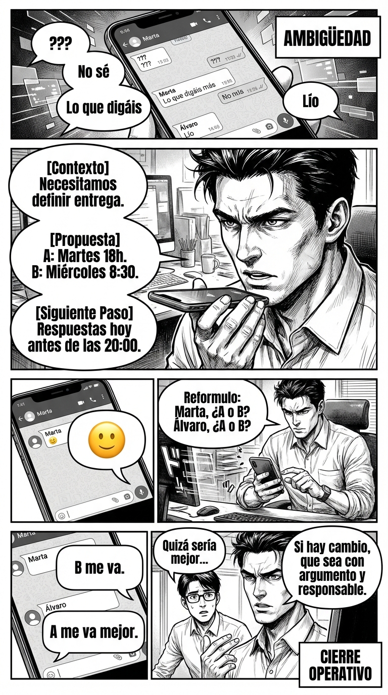

# Día 5 — Estructura CPS: verificar, pedir respuesta, cerrar

> **Objetivo de aprendizaje**: Dominar la estructura "Contexto - Propuesta - Siguiente paso" para eliminar la ambigüedad, evitar hilos infinitos y conseguir compromisos firmes.

## Relato

WhatsApp del equipo de proyecto. Doce mensajes, cero decisiones. Mike graba un audio de 20 segundos:

—**[Contexto:]** Necesitamos definir entrega intermedia. **[Propuesta:]** (A) martes 18:00; (B) miércoles 8:30. **[Siguiente paso:]** Respuestas hoy antes de las 20:00. Marta y Álvaro, ¿confirmáis disponibilidad?

Silencio de siete minutos. Una carita sonriente. Mike insiste, neutral:

—Reformulo para asegurarme de que lo tenemos: Marta, ¿A o B? Álvaro, ¿A o B?

Minuto nueve. Marta: “B me va”. Álvaro: “A me va mejor”.

—Genial. **[Cierro:]** miércoles 8:30 gana; subo agenda y responsables.

Esa tarde, un compañero reabre el tema con un “quizá sería mejor…”. Mike replica:

—Si hay cambio, que sea con **[argumento]** y **[responsable]**. Si no, mantenemos cierre.

## Explicación Profunda

La ambigüedad es el enemigo de la ejecución y el refugio de los manipuladores pasivos. ¿Cuántas veces has salido de una reunión o un chat de grupo sin saber exactamente qué se ha decidido? El caos beneficia a quien no quiere trabajar o a quien quiere rebatir decisiones a posteriori ("yo no dije eso").

Mike utiliza la tríada **CPS (Contexto - Propuesta - Siguiente Paso)** para cortar el ruido.
1.  **Contexto**: Define el problema objektivo. "Necesitamos fecha", "La cocina está sucia". Nadie puede discutir un hecho neutro.
2.  **Propuesta**: Ofrece opciones cerradas (A o B). Esto reduce la carga cognitiva de los demás. Es más fácil elegir que crear.
3.  **Siguiente Paso**: Pone fecha y nombre. "¿Marta, A o B antes de las 20:00?". Sin esto, la propuesta es solo un deseo.

Además, Mike ejerce **Tenacidad en el Cierre**. Cuando le responden con una "carita sonriente" (una respuesta de bajo esfuerzo que no compromete a nada), él no lo deja pasar. Insiste: "¿A o B?". Esto enseña al grupo que con él no valen las medias tintas.
Y cuando alguien intenta reabrir el tema a destiempo ("quizá sería mejor..."), Mike aplica una **tasa de reapertura**: "Si quieres cambiarlo, trae argumento y responsable". Es decir: quejarse tiene un precio. Si no estás dispuesto a pagar el precio (trabajar en la alternativa), el cierre se mantiene.

## Síntesis de Ideas Clave

*   [TPM: High Power Talk] **CPS (Contexto–Propuesta–Siguiente paso)**: Es el algoritmo de la eficacia. Transforma quejas o dudas en planes de acción ejecutables.
*   [TPM: Dominant Conversations] **Cierre Operativo**: Quien cierra la conversación define la realidad. Si tú dices "entonces hacemos X", y nadie se opone, has liderado.
*   [TPM: Assertiveness] **Coste de Reapertura**: No permitas que se deshagan acuerdos por capricho. Exige un "buy-in" real para volver atrás (nueva info o nuevo responsable).

## Ejemplos Prácticos

### 1. El Email de Definición en Entorno Profesional
*   **Situación**: Un cliente te envía un email vago: "No me acaba de convencer el diseño, dadle una vuelta".
*   **Acción**: No trabajes a ciegas. Aplica CPS para acotar.
*   **Frase**: *"**[Contexto]** Entendido que el diseño actual no encaja. **[Propuesta]** Para acertar, necesitamos saber si el fallo es de color o de estructura. **[Siguiente paso]** ¿Podemos tener una llamada de 10 min mañana a las 10:00 para verlo?"*
*   **Por qué funciona**: Conviertes una queja nebulosa en una reunión operativa. Tomas el control del proceso.

### 2. La Logística de Fin de Semana en Entorno Familiar
*   **Situación**: Viernes tarde, nadie sabe qué se hace el sábado. "No sé, lo que queráis", "bueno, ya veremos".
*   **Acción**: Corta el bucle de indecisión.
*   **Frase**: *"**[Contexto]** Mañana va a hacer sol y queremos salir. **[Propuesta]** Opción 1: Playa por la mañana. Opción 2: Zoo. **[Siguiente paso]** Votad ahora. Si no hay votos en 5 min, decido yo Zoo."*
*   **Por qué funciona**: La amenaza creíble de "decido yo" suele motivar a los indecisos a votar rápido.

### 3. La Quedada con Amigos en Entorno Social
*   **Situación**: El típico grupo de WhatsApp donde nadie concreta hora.
*   **Acción**: CPS.
*   **Frase**: *"Chicos, **[Contexto]** hay que reservar si queremos sitio. **[Propuesta]** He visto el Italiano de la plaza. **[Siguiente paso]** Reservo para 6 a las 21:30. Si alguien se cae, que avise antes de las 18:00."*
*   **Por qué funciona**: Pasas de preguntar "¿qué hacemos?" (rol pasivo) a informar de lo que se va a hacer (rol de liderazgo). La gente suele agradecer que alguien tome el mando en cosas triviales.

## Señales de Progreso

1.  **Respuestas binarias**:
    *   *¿Consigues que la gente te responda Sí o No?* Has dejado de recibir "ya veremos" o silencios. Tus preguntas son tan claras que fuerzan una definición.
2.  **Menos hilos de emails/chat**:
    *   *¿Has resuelto en 3 mensajes lo que antes costaba 20?* Eso es eficiencia de poder. Estás ahorrando tiempo a todos.
3.  **Autoridad de cierre**:
    *   *¿Sientes que cuando dices "listo entonces", la gente lo toma como definitivo?* Has construido una reputación de que tu palabra sella acuerdos.

## Errores Habituales

*   **La Propuesta Abierta (Lluvia de ideas falsa)**
    *   *Se ve así*: "Bueno, ¿qué os apetece hacer? Yo había pensado algo, pero no sé..."
    *   *Alternativa*: Trae los deberes hechos. Ofrece menú cerrado. "He visto A o B. ¿Cuál prefieres?"
*   **Olvidar el "Siguiente Paso" (Deadline)**
    *   *Se ve así*: "Hacedme llegar vuestros comentarios." (Sin fecha).
    *   *Resultado*: Nadie lo hace.
    *   *Alternativa*: "...antes del jueves a las 12:00."
*   **Aceptar el "Silencio Administrativo" como Acuerdo**
    *   *Se ve así*: Nadie responde y asumes que es un sí. Luego llega el "ah, yo no leí el mensaje".
    *   *Alternativa*: "Si no decís nada, asumo que es SÍ. ¿Correcto?". Fuerza la validación explícita o implícita blindada.

## Conclusiones

El lenguaje vago es un refugio seguro para quien no quiere comprometerse. El lenguaje CPS es un foco de luz. Al usarlo, te expones (porque propones), pero también obligas a los demás a exponerse (a aceptar o rechazar). Es una herramienta de alta responsabilidad. Úsala para mover las cosas hacia adelante, no solo para mandar, y verás cómo tu entorno empieza a girar "mágicamente" de forma más ordenada.

## Práctica Deliberada

*   **Ficha**: [Juego: Plantilla 3 Pasos Sprint](../juegos/juego_08.md).
*   **Por qué ayuda**: Practica redactar mensajes de WhatsApp usando estrictamente: 1. Hechos. 2. Propuesta. 3. Pregunta de cierre. Revisa tus últimos 10 mensajes enviados: ¿cuántos eran "paja" y cuántos eran CPS?

## Referencias TPM

*   [High Power Talk](https://thepowermoves.com/high-power-talk/): Cómo hablar para obtener resultados y respeto.
*   [Frame Control](https://thepowermoves.com/frame-control-basics/): Cómo el CPS establece un marco de "resolución de problemas" frente al marco de "queja emocional".
