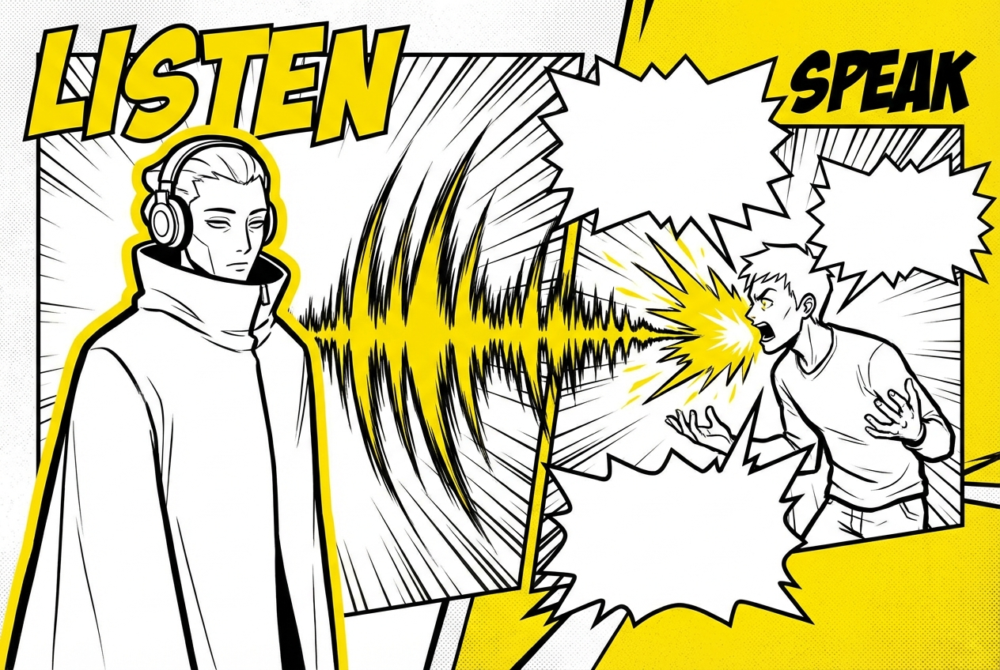

# Día 6 (Extra) — Escucha de alto poder: inteligencia, no sumisión

> **Objetivo de aprendizaje**: Comprender que escuchar no es "callarse y aguantar", sino una maniobra activa para recolectar información valiosa y hacer que el otro baje la guardia.

## Relato

En una cena de negocios, el cliente potencial, Sr. Vargas, no para de hablar de sus problemas con el proveedor anterior. El compañero de Mike, nervioso, intenta interrumpir para vender: "Sí, pero nosotros tenemos un sistema que..."

Vargas sube la voz y sigue quejándose.

Mike le hace una señal suave a su compañero para que pare. Se gira hacia Vargas, le mira a los ojos y asiente lentamente. No dice nada durante tres minutos enteros. Solo escucha con intensidad.

Cuando Vargas hace una pausa para respirar, Mike no vende. Resume:
—Si le entiendo bien, su problema no fue el precio, sino que le prometieron un plazo de 24h y tardaron una semana. Y eso le hizo quedar mal con *su* jefe. ¿Es así?

Vargas se relaja visiblemente, como si le hubieran quitado una mochila de piedras.
—Exacto. Ese fue el maldito problema.

—Entendido —dice Mike—. Entonces, la garantía de plazo es más importante para usted que el descuento por volumen.

—Mucho más —confirma Vargas. Y añade, ya calmado—: ¿Qué me ofrecéis vosotros?

Mike ha conseguido en 5 minutos de silencio lo que su compañero no logró en 20 minutos de charla: la confianza del cliente y la llave de la venta.

## Explicación Profunda

Existe el mito de que el "Líder Alfa" es el que más habla en la sala. En realidad, el que más habla suele ser el que más *necesidad* de validación tiene. El verdadero poder a menudo reside en el silencio estratégico.

La **Escucha de Alto Poder** cumple tres funciones tácticas:
1.  **Recolección de Inteligencia**: Mientras el otro habla, te da munición (sus miedos, sus deseos, sus líneas rojas). Si tú hablas, solo repites lo que ya sabes.
2.  **Validación Emocional**: La gente necesita sentirse escuchada desesperadamente. Cuando les das esa validación (sin necesariamente darles la razón), bajan sus defensas. Dejan de luchar *contra* ti y empiezan a hablar *contigo*.
3.  **Control del Ritmo**: Al escuchar sin interrumpir, demuestras una seguridad aplastante. No tienes prisa. No tienes miedo a lo que digan.

La técnica clave es el **Resumen de Verificación**: Devolverle al otro su argumento con tus palabras ("Si te entiendo bien..."). Esto obliga al otro a decir "SÍ". Y ese "Sí" es el primer paso del acuerdo.

## Síntesis de Ideas Clave

*   **Información es Poder**: Deja que hablen. Cuanto más hablen, más revelan.
*   **Tactical Empathy**: Entender la emoción del otro (y nombrarla) es la forma más rápida de desactivar la hostilidad. (Chris Voss).
*   **La Paradoja del Interesante**: Para ser interesante, sé *interesado*. A la gente le encantan los buenos oyentes.

## Ejemplos Prácticos

### 1. Pareja enfadada
*   **Ella**: "¡Nunca me ayudas con nada, estoy harta!"
*   **Tú (Mal)**: "¡Eso es mentira, ayer lavé el coche!" (Defensivo).
*   **Tú (Bien/Escucha)**: (Silencio 3s). "Te noto muy quemada. Sientes que toda la carga está sobre ti, ¿verdad?" (Resumen emocional).
*   **Resultado**: Ella se siente comprendida y baja el arma. Ahora podéis negociar tareas.

### 2. Jefe micro-manager
*   **Jefe**: "Quiero que me pongas en copia de todos los correos."
*   **Tú**: "¿Es porque te preocupa que se nos escape algún detalle con el cliente X?" (Buscas la intención).
*   **Jefe**: "Sí, es un cliente difícil."
*   **Tú**: "Entendido. Lo haré." (Has validado su miedo, no has peleado por tu ego).

## Señales de Progreso

1.  **Aguantas el silencio**: No te pones nervioso cuando hay una pausa.
2.  **Buscas el "¡Eso es!"**: Tu objetivo no es que te digan "tienes razón", sino "¡eso es exactamente lo que me pasa!".
3.  **No preparas tu respuesta**: Mientras el otro habla, no estás pensando qué vas a decir tú. Estás escuchando de verdad.

## Errores Habituales

*   **La "Escucha fake"**: Asentir mientras piensas en la lista de la compra. Se nota en los ojos.
*   **El "Y yo más"**: "Me duele la cabeza" -> "Uy, pues a mí ayer me dolía más". (Narcisismo conversacional).

## Conclusiones

La boca sirve para persuadir; los oídos sirven para leer la realidad. No puedes navegar un terreno que no has mapeado. Escucha primero, dispara después.

## Práctica Deliberada

*   **Ficha**: [Juego 6: Escucha Espejo](../juegos/juego_06.md).
*   **Por qué ayuda**: Este juego te obliga a repetir *exactamente* lo que dijo el otro antes de dar tu opinión. Es el entrenamiento definitivo para curar la impaciencia.
