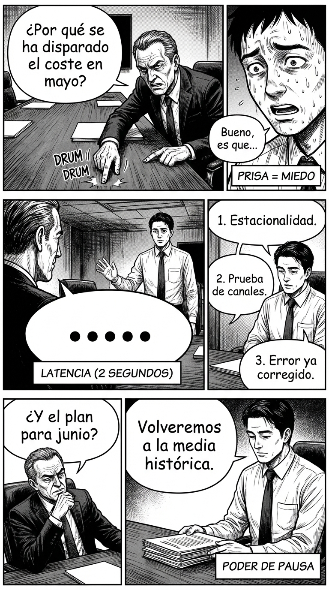

# Día 8 — Pausa y latencia: cómo el silencio construye autoridad

> **Objetivo de aprendizaje**: Aprender a desacelerar tus respuestas para proyectar reflexión y control, evitando la reactividad nerviosa que disminuye el estatus.

## Relato

Reunión de presupuesto. El director financiero lanza una pregunta afilada: "¿Por qué se ha disparado el coste de adquisición en mayo?".

El instinto de Carlos es saltar inmediatamente: "Bueno, es que hubo un cambio en el algoritmo y..." Su voz tiembla ligeramente por la prisa. Suena a excusa.

Mike interviene. Antes de hablar, **[Pausa: 2 segundos]**. Respira. Mira al director a los ojos. El silencio pesa en la sala.

—El coste subió por tres factores —dice Mike, con un **[ritmo lento]**, casi perezoso—. Uno: estacionalidad. Dos: prueba de nuevos canales. Tres: error de atribución ya corregido.

El director asiente. —Vale. ¿Y el plan para junio?

Mike vuelve a pausar. No tiene prisa. Pareciera que está consultando con un oráculo interno.
—Para junio volveremos a la media histórica. —Silencio final.

Nadie le discute. Su latencia ha transmitido un mensaje subconsciente: "Estoy tan seguro de mí mismo que no necesito correr para complacerte".

## Explicación Profunda

La **latencia de respuesta** es el tiempo que pasa desde que alguien termina de hablar hasta que tú empiezas.
En dinámicas de bajo poder (empleado asustado, niño castigado), la latencia es cercana a cero o negativa (interrupción). Sentimos la urgencia de responder para "quitarle la razón" al otro o para demostrar que somos eficientes.

En dinámicas de alto poder, la latencia se expande. ¿Por qué?
1.  **Señal de Procesamiento**: La pausa dice "estoy pensando". Lo que vas a decir no es una reacción visceral, es una conclusión intelectual. Eso le da peso de verdad.
2.  **Control del Tiempo**: Al hacer esperar a la sala (aunque sea 1.5 segundos), tú controlas el recurso más valioso: el tiempo de todos. Eres el dueño del reloj.
3.  **Seguridad**: Solo quien no teme ser interrumpido se atreve a callar. El silencio proyecta: "Sé que me escucharéis cuando yo decida hablar".

No se trata de callar por callar (eso sería "stonewalling" o bloqueo). Se trata de una pausa *habitada*, con contacto visual, una pausa que dice "te he escuchado, lo estoy pesando, y aquí tienes mi veredicto".

## Síntesis de Ideas Clave

*   **Latencia y Estatus**: A mayor estatus, mayor tendencia a pausas largas y movimientos lentos. La prisa es de los sirvientes; la calma es de los reyes.
*   **Respuesta Reflexiva vs. Reactiva**: La pausa rompe el ciclo de "estímulo-reacción". Te permite elegir tu marco en lugar de caer en el marco del otro.
*   **Gravedad**: Hablar un 20% más despacio de lo normal hace que tu voz suene más profunda y tus palabras parezcan más importantes.

## Ejemplos Prácticos

### 1. La Pregunta Trampa en Entorno Profesional
*   **Situación**: "¿Estás seguro de que esto va a funcionar?" (Tono escéptico).
*   **Acción**: Pausa larga + Respuesta corta.
*   **Frase**: (Mira los papeles. Mira al interlocutor. 3 segundos). *"Sí. Lo estoy."*
*   **Por qué funciona**: Si respondes rápido "sí sí claro porque mira...", suenas defensivo. El silencio previo convierte tu "Sí" en una sentencia.

### 2. El Niño que Pide Algo Insistentemente
*   **Situación**: "¡Papá, cómprame esto, porfa, porfa, porfa!"
*   **Acción**: Detente. Baja tu altura a la suya. Mírale hasta que se calle.
*   **Frase**: (Pausa hasta tener su atención completa). *"Hoy no compramos juguetes. La respuesta es no."*
*   **Por qué funciona**: La pausa frena su inercia histérica. Le obligas a bajar revoluciones para recibir tu mensaje.

### 3. La Discusión de Pareja
*   **Situación**: Tu pareja te acusa de algo injusto.
*   **Acción**: En lugar de contraatacar ("¡Y tú qué!"), respira y procesa.
*   **Frase**: (Silencio de 5 segundos). *"Me ha sorprendido que digas eso. Necesito pensarlo un momento."*
*   **Por qué funciona**: Desactivas la pelea inmediata. Demuestras que te tomas en serio sus palabras (tanto que necesitas pensarlas), lo cual valida al otro, pero mantienes tu control.

## Señales de Progreso

1.  **Comodidad en el vacío**:
    *   *¿Ya no sientes pánico cuando hay silencio?* Antes, el silencio te parecía un "error" a corregir. Ahora es tu lienzo.
2.  **Menos "ehhh"**:
    *   *¿Han desaparecido tus muletillas?* Las muletillas son intentos de llenar el silencio mientas piensas. Si te permites el silencio, ya no necesitas el "ehhh".
3.  **La gente espera**:
    *   *¿Notas que los demás no te interrumpen durante tus pausas?* Han aprendido que no has terminado, que solo estás pensando. Eso es respeto ganado.

## Errores Habituales

*   **Pausa con Cara de Susto**
    *   *Se ve así*: Quedarse callado con los ojos muy abiertos y boca entreabierta (congelación).
    *   *Alternativa*: Pausa con cara de "interesante...". Ojos entornados, boca cerrada, asentimiento lento.
*   **La Pausa Eterna (Incomodidad)**
    *   *Se ve así*: Callar más de 4-5 segundos sin avisar. Parece que se te ha ido el wifi.
    *   *Alternativa*: Si necesitas pensar mucho, dilo. "Dame un minuto para pensar esto."
*   **Responder Rápido para Complacer**
    *   *Se ve así*: Asentir antes de que el otro termine la frase.
    *   *Alternativa*: Espera a que termine. Cuenta "uno, dos" mentalmente. Responde.

## Conclusiones

La velocidad mata la autoridad. En un mundo hiper-acelerado, quien tiene el coraje de ir despacio se vuelve magnético. Prueba hoy a ser el más "lento" de la sala (no de mente, sino de tempo). Verás cómo los demás empiezan a orbitar alrededor de tu gravedad.

## Práctica Deliberada

*   **Ficha**: [Juego: Semáforo del Poder](../juegos/juego_01.md) (Variante Lenta).
*   **Por qué ayuda**: Juega a responder preguntas sencillas ("¿qué comiste ayer?") obligándote a esperar 3 segundos de reloj antes de abrir la boca. Siente la ansiedad subir y obsérvala sin actuar.

## Referencias

*   [Frame control when low energy](https://thepowermoves.com/forum/topic/frame-control-when-low-energy/): Cómo usar la baja energía y la lentitud como una herramienta de poder (el arquetipo del "Padrino").
