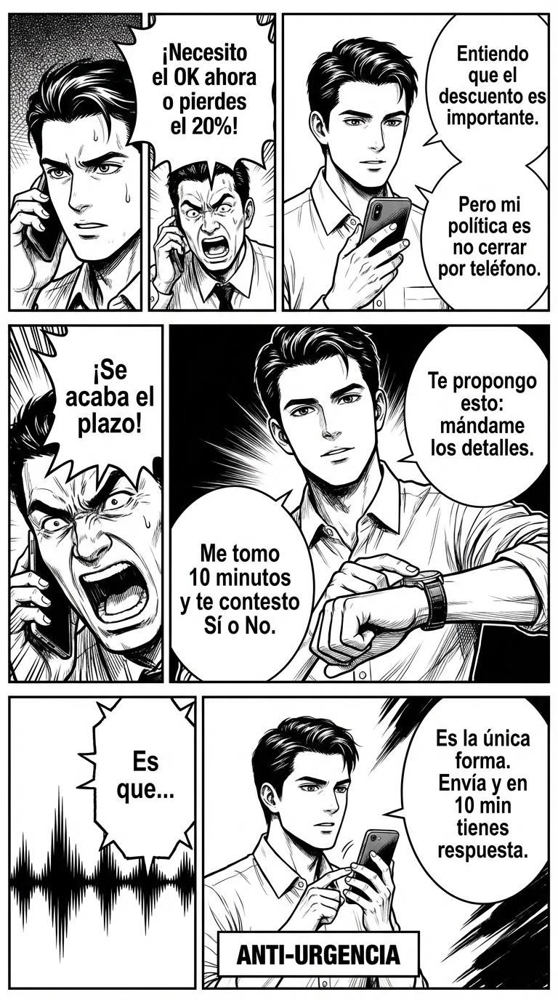

# Día 10 — Pedir tiempo sin perder estatus

> **Objetivo de aprendizaje**: Aprender a posponer una decisión o respuesta cuando no estás preparado, manteniendo tu autoridad y evitando ser presionado a aceptar acuerdos desventajosos.

## Relato

Un proveedor presiona a Mike por teléfono: "Es una oferta exclusiva, pero necesito el OK ahora mismo o perdemos el descuento del 20%". La técnica de urgencia clásica.

Mike siente la presión en el estómago. Sabe que si decide ya, se equivocará. Pero no quiere parecer indeciso.

—Entiendo que el descuento es importante —dice Mike con voz tranquila, validando—. Sin embargo, mi política es no cerrar contratos por teléfono.

—Pero Mike, ¡se acaba el plazo! —insiste el vendedor.

—**[Pedir Tiempo:]** Lo sé. Te propongo esto: mándame los detalles al mail. **Me tomo 10 minutos** para revisarlo con calma y te contesto antes de las 12:00 con un Sí o un No definitivo.

—Es que...

—**[Disco Rayado:]** Es la única forma de que pueda darte el OK. Envíalo y en 10 minutos tienes respuesta.

Mike no pidió "perdón", ni dijo "no sé". Dijo "necesito revisar". Transformó su indecisión en **diligencia debida** (un rasgo de alto estatus).

## Explicación Profunda

Una de las jugadas de poder más comunes es la **Falsa Urgencia**. Los vendedores, jefes o familiares manipuladores intentan acelerar tu toma de decisiones porque saben que, con prisa, tu cerebro lógico se apaga y decides por emoción (miedo a perder la oportunidad o deseo de complacer).

Caer en la urgencia es de bajo estatus (reactividad). Detener la urgencia es de alto estatus (control).

El problema es cómo pedir tiempo sin parecer tonto o lento. La clave está en el **enmarcado**:
*   **Marco Débil**: "Ay, es que no sé, estoy liado, déjame ver..." (Suenas desbordado).
*   **Marco Fuerte**: "Quiero darle a esto la atención que merece. Lo reviso y vuelvo contigo." (Suenas profesional y responsable).

La estructura que usa Mike es:
1.  **Validar**: "Entiendo la prisa".
2.  **Imponer Proceso**: "Mi política es..." (Tener políticas personales proyecta mucha autoridad).
3.  **Compromiso Específico**: "Vuelvo en 10 minutos / mañana". Esto elimina el miedo del otro a que le estés dando largas indefinidas.

## Síntesis de Ideas Clave

*   [TPM: High Power Talk] **Comprar Tiempo**: Nunca negocies cuando tengas hambre, sueño, prisa o estés enfadado. El tiempo es tu mejor aliado para recuperar la racionalidad.
*   [TPM: Assertiveness] **El Disco Rayado**: Si insisten, repite tu petición de tiempo con las mismas palabras, sin enfadarte y sin añadir nuevas justificaciones.
*   [TPM: Power Dynamics] **La Política Personal**: Frases como "Yo nunca decido en caliente" o "Consulto todo con mi almohada/socio" externalizan la negativa. No es que no *quieras* responder, es que tu *regla* te lo impide.

## Ejemplos Prácticos

### 1. El Jefe que pide un imposible "para ya"
*   **Situación**: "Necesito este informe para dentro de una hora."
*   **Acción**: No digas sí (imposible) ni no (negativa). Pide tiempo para evaluar.
*   **Frase**: *"Déjame 5 minutos para ver qué tengo en la mesa y te digo qué es realista entregar hoy y qué no."*
*   **Por qué funciona**: "Déjame ver" demuestra que te tomas en serio la petición, pero te da el control para re-negociar desde los datos, no desde el pánico.

### 2. La Invitación Social Inesperada
*   **Situación**: "¿Te vienes este finde a la casa rural? Tenemos que reservar ya."
*   **Acción**: No te sientas obligado.
*   **Frase**: *"Suena genial. **[Freno]** Tengo que chequear mi agenda familiar antes de comprometerme. Os confirmo mañana por la mañana sin falta."*
*   **Por qué funciona**: Proteges tu tiempo. Si dices sí rápido y luego te arrepientes, quedas peor (poco fiable). Si dices "mañana te digo" y cumples, quedas como un señor.

### 3. La Negociación de Precio
*   **Situación**: "¿Cuánto cobras por esto? Dámelo barato."
*   **Acción**: Nunca des precio en el acto si no estás seguro.
*   **Frase**: *"Es un proyecto interesante. Para darte un precio justo necesito hacer un par de números. **[Cierre]** Te paso el presupuesto esta tarde."*
*   **Por qué funciona**: Dar precio al voleo te hace parecer un mercadillo. Calcularlo te hace parecer una consultora.

## Señales de Progreso

1.  **Stop automático**:
    *   *¿Tu primera reacción ante la presión es "Espera"?* Has desactivado el resorte de "Siwana" (Sí Bwana). Tu cuerpo ya sabe que no tiene que obedecer al instante.
2.  **Fechas cumplidas**:
    *   *¿Cuando dices "vuelvo en 10 min", vuelves en 10 min?* Esto es vital. Si pides tiempo y no cumples, eres un procrastinador. Si cumples, eres un líder.
3.  **Menos arrepentimiento**:
    *   *¿Tomas mejores decisiones?* Al enfriar las emociones, te das cuenta de que esa "oferta increíble" no lo era tanto. Te ahorras problemas.

## Errores Habituales

*   **El "No sé" (Inseguridad)**
    *   *Se ve así*: "Puff, no sé tío, es que..."
    *   *Alternativa*: "Déjame pensarlo." (Firmeza).
*   **Pedir Permiso para Pensar**
    *   *Se ve así*: "¿Te importa si te lo digo luego?"
    *   *Alternativa*: Informar. "Te lo digo luego."
*   **Usar el Tiempo para Huir (Ghosting)**
    *   *Se ve así*: Dices "te digo algo" con la intención de no volver a contestar nunca.
    *   *Resultado*: Pérdida total de respeto.
    *   *Alternativa*: Si es No, dilo ya. "No me interesa, gracias." Usa el tiempo solo si es un "Tal vez".

## Conclusiones

La prisa es una forma de violencia psicológica leve. Al negarte a correr, estás poniendo un límite de dignidad. Recuerda: eres dueño de tu "Sí" y de tu "No". Regalarlo barato bajo presión devalúa tu palabra. Tómate tu tiempo; es tuyo.

## Práctica Deliberada

*   **Ficha**: [Juego: No + Alternativa](../juegos/juego_05.md) (Variante Tiempo).
*   **Por qué ayuda**: Cuando alguien te pida un favor pequeño (p.ej. "¿me pasas la sal?"), entrena el micro-retraso. "Claro, dame un segundo". Termina de masticar o de beber, y luego pásala. Rompe el automatismo de servidumbre inmediata.

## Referencias TPM

*   [High Power Talk](https://thepowermoves.com/high-power-talk/): Técnicas verbales para mantener el control.
