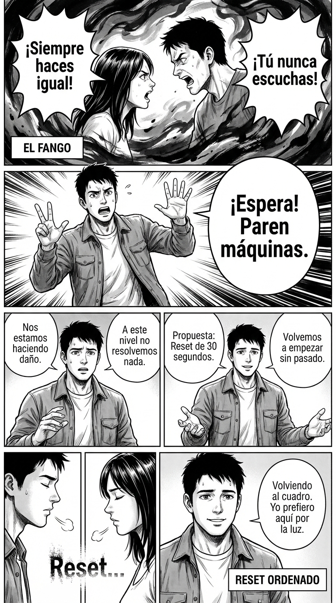

# Día 12 — Reset ordenado: salir del fango

> **Objetivo de aprendizaje**: Aprender a reiniciar una conversación que se ha vuelto tóxica o improductiva, devolviéndola al punto de partida constructivo sin culpar a nadie.

## Relato

La discusión ha escalado. Empezó por dónde colgar un cuadro y ahora están gritando sobre quién es más egoísta. "¡Siempre haces lo que quieres!", "¡Y tú nunca escuchas!". Están en el fango emocional.

Mike se da cuenta de que seguir argumentando ahí es inútil. Cualquier cosa que diga será usada en su contra. Necesita un **Reset**.

Se calla. Da un paso atrás físicamente. Levanta las manos con las palmas abiertas (gesto de paz, no de rendición).

—**[Stop:]** Espera. Paren máquinas. —Su voz es firme pero no agresiva—. Nos estamos haciendo daño y estamos perdiendo el foco. A este nivel no resolvemos nada.

Silencio tenso. El otro respira agitado.

—**[Propuesta de Reset:]** Hagamos un **reset de 30 segundos**. Silencio. Respiramos. Y volvemos a empezar solo con el tema del cuadro. Sin pasado. ¿Podemos intentarlo?

El otro asiente, agotado también de la pelea. Tras la pausa, Mike retoma con tono suave:

—Volviendo al cuadro. Yo prefiero aquí por la luz. ¿Tú dónde lo ves mejor?

Han salido del túnel.

## Explicación Profunda

Las discusiones tienen inercia. Cuando entran en espiral negativa (reproches, gritos, sarcasmo), la inercia empuja a seguir bajando. Intentar "ganar" una discusión que ya está podrida es imposible; solo puedes perder.

El **Reset Ordenado** es una técnica de **Metajuego**. Sales del contenido ("el cuadro") para arreglar el proceso ("la forma en que hablamos").
1.  **Interrupción física y verbal**: "Paren máquinas". Rompe el patrón.
2.  **Diagnóstico neutral**: "Nos estamos haciendo daño". Nótese el "nos". No dice "me estás gritando" (culpa), sino "esto no funciona" (problema compartido).
3.  **Oferta de reinicio**: Propones borrar la pizarra. Es una oferta muy seductora porque permite al otro salvar la cara. No tiene que admitir que se equivocó, solo tiene que aceptar "empezar de nuevo".

Es el equivalente a reiniciar el ordenador cuando se cuelga. No buscas qué programa falló; simplemente reinicias para volver a ser operativos.

## Síntesis de Ideas Clave

*   **El Árbitro de la Dinámica**: Alguien tiene que darse cuenta de que el juego se ha ensuciado y pitar falta. Ese eres tú.
*   **Salir del Marco Emocional**: Cuando la amígdala (cerebro emocional) está al mando, no hay razonamiento. El "reset" (pausa + respiración) permite que el córtex prefrontal (lógica) vuelva a conectarse.
*   **Salvar la Cara**: El reset permite a todos dar un paso atrás sin sentirse humillados. "Borrón y cuenta nueva" es una herramienta diplomática de alto nivel.

## Ejemplos Prácticos

### 1. La Reunión Atascada en Bucle
*   **Situación**: Llevan una hora dando vueltas a lo mismo y la gente está irritable.
*   **Acción**: Reset de Agenda.
*   **Frase**: *"Chicos, estamos en bucle. **[Reset]** Borremos la última media hora. Si tuviéramos que decidir ahora mismo con lo que sabemos, ¿qué haríamos? Empecemos desde ahí."*

### 2. El Niño con Rabieta
*   **Situación**: Gritos, lloros, nada funciona.
*   **Acción**: Cambio de escenario (Reset físico).
*   **Frase**: *"Veo que estás muy disgustado y yo me estoy enfadando. **[Reset]** Vamos a la cocina a beber un vaso de agua los dos. No hablamos hasta que bebamos el agua."*
*   **Por qué funciona**: El cambio de habitación y la acción física de beber agua rompen el estado fisiológico de la rabieta.

### 3. El Error Incómodo en Público
*   **Situación**: Has dicho algo inapropiado o te has equivocado de nombre y hay un silencio raro.
*   **Acción**: Auto-reset rápido.
*   **Frase**: *"Uy, eso ha sonado fatal. **[Reset]** Rebobino. Lo que quería decir es..."*
*   **Por qué funciona**: Reconocer el error ("ha sonado fatal") y corregirlo al instante ("rebobino") demuestra seguridad. Ignorarlo hace que la incomodidad crezca.

## Señales de Progreso

1.  **Reconoces la "Fiebre"**:
    *   *¿Sientes cuándo una discusión ha pasado el punto de no retorno?* Ya no intentas razonar cuando hay gritos. Sabes que primero hay que bajar la fiebre (reset) antes de curar la enfermedad.
2.  **Liderazgo emocional**:
    *   *¿Eres capaz de mantenerte calmado mientras propones el reset?* Si gritas "¡CALMAOS!", no estás haciendo un reset, estás echando gasolina. El reset se pide desde la calma.
3.  **Gratitud ajena**:
    *   *¿Notas alivio en los demás?* A menudo, el otro también quiere parar pero no sabe cómo bajarse del tigre. Tu oferta de reset es su salvavidas.

## Errores Habituales

*   **El Reset Culpabilizador**
    *   *Se ve así*: "Para, que te estás poniendo histérica. Vamos a empezar de nuevo cuando te calmes."
    *   *Resultado*: Ataque nuclear. Has invalidado al otro.
    *   *Alternativa*: "Los dos estamos alterados. Paremos por el bien de los dos."
*   **Seguir Refunfuñando tras el Reset**
    *   *Se ve así*: "Vale, empezamos de nuevo... pero es que vaya tela lo que has dicho antes."
    *   *Resultado*: El reset ha fallado. Has traído la basura al presente.
    *   *Alternativa*: Amnesia táctica perfecta. Lo dicho antes, muerto está.
*   **Esperar demasiado**
    *   *Se ve así*: Proponer el reset cuando ya se han dicho insultos imperdonables.
    *   *Alternativa*: Resetear a la primera señal de toxicidad. Mejor cinco resets pequeños que uno tardío.

## Conclusiones

Tener la capacidad de decir "borrón y cuenta nueva" es un superpoder. Te permite cometer errores y corregirlos, te permite gestionar conflictos sin quemar puentes. No tengas miedo a detener la película y decir: "Esta toma ha salido mal. ¡Corten! Vamos a rodar la siguiente".

## Práctica Deliberada

*   **Ficha**: [Juego: Semáforo del Poder](../juegos/juego_01.md) (Variante Reset).
*   **Por qué ayuda**: Cuando detectes que estás en "Rojo" (reaccionando mal), di en voz alta "Rojo. Reset". Respira. Pasa a "Verde" (CPS). Entrena el interruptor.

