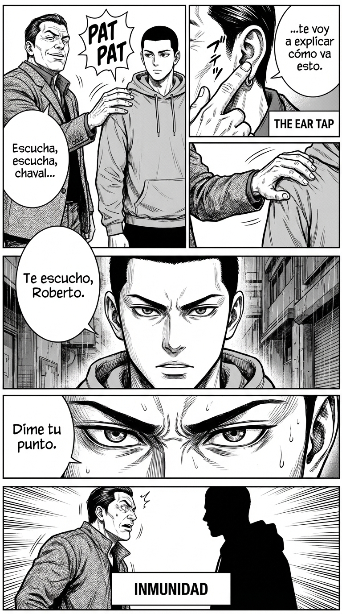

# Día 14 — Nótese y neutralícese la “ear tap”: gestos de dominio

> **Objetivo de aprendizaje**: Identificar y neutralizar gestos sutiles de dominancia física (como tocarte, interrumpirte con gestos, o el "ear tap") para mantener tu autonomía sin crear una escena.

## Relato

Mike está hablando con un compañero veterano, Roberto. Mientras Mike explica su idea, Roberto estira la mano y le da unos golpecitos condescendientes en el brazo ("patting"). Luego, hace un gesto de tocarse la oreja (**Ear Tap**) y dice: "Escucha, escucha, chaval, que te voy a explicar cómo va esto".

Es una jugada de poder física. Roberto le está tratando como a un niño o un subordinado. Invade su espacio y silencia su voz.

Mike no se aparta bruscamente, lo que denotaría miedo.
Primero, ejecuta la **[Neutralización Física]**: con suavidad pero firmeza, levanta su propia mano y retira la de Roberto de su brazo mientras da un paso lateral para romper el contacto.

Roberto ha insistido con el gesto de tocarse la oreja, diciendo "escucha, chaval". Mike ignora la orden implícita de callarse.
Mantiene el contacto visual —serio, sin la sonrisa complaciente de antes— y responde con voz grave:
—**[Neutralización Verbal]**: Te escucho, Roberto. Dime tu punto.

Al verbalizar "Te escucho" con tono de adulto, Mike rechaza el marco de "alumno" y establece un marco de "pares".

## Explicación Profunda

El **Ear Tap** (tocarse la oreja o hacer gesto de "escucha") es un clásico "Power Move" descrito por TPM. Es un gesto de dominancia que dice: "Lo que tú hablas no importa, lo que yo digo es la verdad; abre las orejas".
Otros gestos similares son:
*   **El "Patting"**: Palmadas en la espalda o el hombro (si no hay confianza). Dicen: "Bien hecho, chico". Te encuadran como subordinado.
*   **El Dedo Índice en la Cara**: Agresión directa.
*   **Ocupar tu Mesa**: Poner sus cosas en tu zona.

La clave para neutralizar esto es: **No Validar**.
Si alguien te da palmadas y tú sonríes, aceptas el rol de subordinado.
Si alguien te manda callar (gesto) y tú te callas mirando al suelo, obedeces.

La respuesta de alto poder es la **Inmunidad**.
1.  **Rompe el contacto**: Si te tocan sin permiso y no te gusta, retírate o retira su mano. Es tu cuerpo.
2.  **Ignora la orden gestual**: Si te hacen el "shhh" o el "ear tap", sigue hablando o di "Termino la frase y vamos contigo".
3.  **Meta-comentario** (si insisten): "Prefiero que no me toques el hombro mientras hablamos". Dicho con calma, es devastador para el "bully".

## Síntesis de Ideas Clave

*   **El "Ear Tap"**: Señal de arrogancia. Quien lo hace cree que tiene el monopolio de la verdad. No te enfades, pero no te sometas.
*   **Tocar sin permiso**: Es una forma de marcar territorio. En el reino animal, el dominante toca al subordinado, no al revés. Recupera tu soberanía corporal.
*   **Respuesta Proporcional**: Usa la fuerza mínima necesaria. Un paso atrás es mejor que un empujón. Una mirada seria es mejor que un insulto.

## Ejemplos Prácticos

### 1. El "Amigo" que te agarra el cuello/hombro
*   **Situación**: Alguien te pasa el brazo por encima del hombro de forma pesada y dominante.
*   **Acción**: Maniobra de escape suave + Mirada.
*   **Frase**: (Gira el cuerpo para que su brazo caiga). Mírale a los ojos. Sonríe *menos*. *"Dime, ¿qué me contabas?"*
*   **Por qué funciona**: Le quitas el brazo de encima "accidentalmente" (al girarte), pero el mensaje no verbal es claro: "No me retengas".

### 2. El Gesto de "Cállate" (Palma levantada)
*   **Situación**: Estás hablando y te ponen la mano en la cara ("Talk to the hand" o stop).
*   **Acción**: Aparta la mano visualmente o verbalmente.
*   **Frase**: *"No me pongas la mano, por favor. Déjame terminar."*
*   **Por qué funciona**: Pones un límite físico a su mala educación. Es una defensa legítima de tu estatus.

### 3. El Invasor de Escritorio
*   **Situación**: Un compañero se sienta en tu mesa o pone sus papeles sobre tu portátil.
*   **Acción**: Territorialidad.
*   **Frase**: (Mueve sus papeles suavemente hacia él). *"Perdona, me tapabas la pantalla. Cuéntame."*
*   **Por qué funciona**: Recuperas tu territorio. Si no lo haces, su "colonización" avanzará.

## Señales de Progreso

1.  **Soberanía territorial**:
    *   *¿Tu cuerpo es tuyo?* Ya no permites que nadie invada tu burbuja sin tu permiso explícito. Te sientes con derecho a decir "atrás".
2.  **Ojo clínico**:
    *   *¿Ves los trucos?* Antes pensabas que ese tío era "muy simpático" por darte palmadas. Ahora ves que quizás está intentando quedar por encima. Ver Matrix te permite esquivar las balas.
3.  **Reacción calmada**:
    *   *¿No saltas?* Ante un gesto dominante, no devuelves un puñetazo. Simplemente te reajustas y sigues. Tu estatus es inamovible.

## Errores Habituales

*   **La Risa Nerviosa al ser Tocado**
    *   *Se ve así*: Te dan una colleja "de broma" y te ríes "jaja".
    *   *Resultado*: Has dicho "puedes pegarme".
    *   *Alternativa*: Cara seria. "¿Qué haces?". Silencio.
*   **La Escalada Física**
    *   *Se ve así*: Él te empuja, tú le empujas. Pelea de bar. Baja clase.
    *   *Alternativa*: Verbalizar. "No me toques".
*   **Congelarse**
    *   *Se ve así*: Te incomoda pero no haces nada.
    *   *Alternativa*: Muévete. Un paso atrás es una acción de poder (eliges dónde estar).

## Conclusiones

Los juegos de poder físicos son primitivos, pero suceden a diario en oficinas y bares. No necesitas ser un experto en artes marciales, solo necesitas tener claro dónde acaba el aire y dónde empiezas tú. Tu piel es la frontera de tu reino. Defiéndela con cortesía pero con hierro.

## Práctica Deliberada

*   **Ficha**: [Juego 11: Tocar No Es Gratis](../juegos/juego_11.md).
*   **Por qué ayuda**: Role-play con alguien de confianza. Que te toque el hombro, la cabeza, el brazo. Practica diferentes formas de retirarte o retirar su mano sin ser agresivo, solo firme. Busca el movimiento mínimo eficaz.

## Referencias

*   [Dominant Body Language Power Move: The Ear Tap](https://thepowermoves.com/dominant-body-language-example-pictorial/): Análisis específico de este gesto y cómo responder.
*   [People touching me to establish dominance](https://thepowermoves.com/forum/topic/people-touching-me-seemingly-to-establish-dominance-when-the-conversation-ends/): Hilo del foro con estrategias reales.
