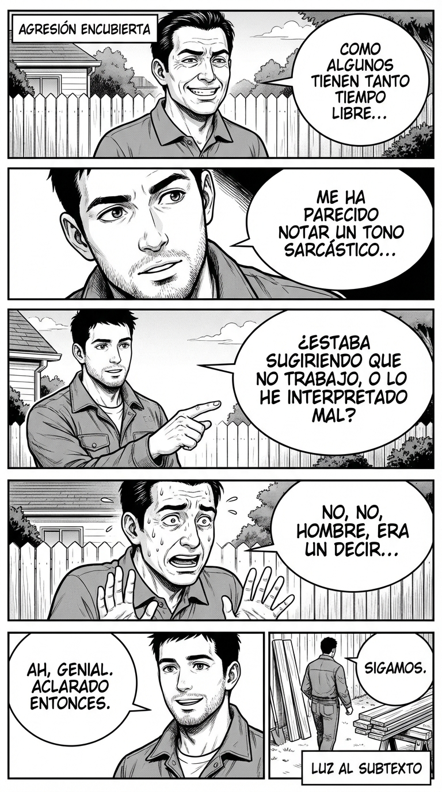

# Día 17 — Nombrar subtexto sin agresión: sacar la basura

> **Objetivo de aprendizaje**: Aprender a exponer las intenciones ocultas o el "aire denso" de una conversación sin atacar, para desactivar la tensión pasivo-agresiva.

## Relato

Reunión de vecinos. Uno de ellos, el Sr. García, dice sonriendo:
—Claro, como algunos tienen tanto tiempo libre, pueden dedicarse a estas cosas de la comunidad...

Es un ataque velado a Mike (que trabaja desde casa). Si Mike se enfada ("¡Yo trabajo mucho!"), parece inseguro. Si lo ignora, acepta el insulto.

Mike decide **sacar el subtexto a la superficie**.
Con tono de curiosidad genuina, pregunta:
—Me ha parecido notar un tono sarcástico ahí, Sr. García. **[Nombrar Subtexto:]** ¿Estaba sugiriendo que no trabajo, o lo he interpretado mal?

García se pone nervioso. La agresión encubierta solo funciona en la oscuridad.
—No, no, hombre, era un decir...

—Ah, genial. **[Cierre:]** Aclarado entonces. Gracias por valorar mi tiempo. Sigamos.

Mike ha expuesto la "basura" (el sarcasmo), ha obligado al otro a recogerla (retractarse) y ha cerrado con clase.

## Explicación Profunda

El **Subtexto** es lo que se dice "entre líneas". La gente pasivo-agresiva es maestra en el subtexto: te insultan sin usar palabras insultantes, usando el tono o la implicación.

La técnica de **Nombrar el Subtexto** (o "Meta-comentario de Intención") es como encender la luz en una habitación llena de cucarachas. Las cucarachas corren a esconderse.
Al preguntar explícitamente "¿Estás sugiriendo X?", obligas al agresor a tomar responsabilidad por su ataque. Como los cobardes no quieren responsabilidad, lo niegan. Y al negarlo, pierden el poder de herirte.

Es crucial hacerlo **sin agresión**. Mike no dice "¡Eres un imbécil sarcástico!". Dice "Me ha parecido notar...". Usa la duda ("¿o lo he interpretado mal?"). Esto le da al otro una salida digna ("no, te has equivocado") y evita la guerra abierta, pero deja claro el mensaje: "Te he visto. No lo hagas más".

## Síntesis de Ideas Clave

*   **El Poder de la Luz**: La agresión encubierta no sobrevive a la exposición directa. Sácala a la luz y morirá.
*   **La Pregunta de Aclaración**: "¿Qué quieres decir exactamente con eso?" es la mejor defensa contra la ambigüedad maliciosa.
*   **Calibración**: No acuses, pregunta. Si acusas, te dirán "qué paranoico eres". Si preguntas, te dirán "no, qué va", y habrás ganado igual.

## Ejemplos Prácticos

### 1. El "Elogio" Envenenado
*   **Situación**: "Para haber estudiado en la pública, escribes muy bien."
*   **Acción**: Pide explicación literal.
*   **Frase**: *"Gracias... aunque me pierdo con la primera parte. **[Subtexto]** ¿La implicación es que en la pública no enseñan a escribir?"*
*   **Por qué funciona**: Le obligas a explicar su clasismo o a decir "no no, qué va". En ambos casos, queda en evidencia.

### 2. El Silencio Castigador
*   **Situación**: Alguien te deja de hablar (Ley del Hielo) para manipularte.
*   **Acción**: Nombra la táctica.
*   **Frase**: *"Noto que estás muy callado hoy. **[Subtexto]** ¿Es una forma de castigarme por lo de ayer o simplemente estás cansado?"*
*   **Por qué funciona**: Desactivas el castigo. Si dice "estoy cansado", tiene que hablarte. Si dice "te castigo", puedes hablar del conflicto abiertamente.

### 3. La Risa Inapropiada
*   **Situación**: Te caes o te equivocas y alguien se ríe con maldad.
*   **Acción**: Pregunta por la gracia.
*   **Frase**: *"Os veo muy divertidos. **[Subtexto]** ¿Me contáis el chiste para que nos riamos todos?"*
*   **Por qué funciona**: Clásica de profesor. Explicar por qué te ríes de la desgracia ajena es socialmente vergonzoso. Dejarán de reír.

## Señales de Progreso

1.  **Detección de "Mal rollo"**:
    *   *¿Confías en tu instinto?* Antes pensabas "será cosa mía". Ahora sabes que si sientes un pinchazo, es que hubo aguja.
2.  **Valentía social**:
    *   *¿Te atreves a crear ese momento incómodo?* Nombrar el subtexto genera tensión momentánea. Soportar esa tensión es señal de alto estatus.
3.  **Ambiente más limpio**:
    *   *¿La gente deja de lanzarte puyas?* Cuando saben que tienes un radar y que lo usas, dejan de intentarlo. Es disuasión nuclear.

## Errores Habituales

*   **Acusar violentamente**
    *   *Se ve así*: "¡Sé que te estás riendo de mí, desgraciado!"
    *   *Resultado*: Te llaman loco. Pierdes.
    *   *Alternativa*: Curiosidad fría. "¿Hay algo gracioso?"
*   **Tragárselo y rumiar**
    *   *Se ve así*: Te vas a casa pensando "debería haberle dicho...".
    *   *Alternativa*: Dilo en el acto. Aunque sea torpe. Mejor fuera que dentro.

## Conclusiones

Las relaciones sanas no tienen subtextos tóxicos. Tienen textos claros. Al limpiar el subtexto, no solo te defiendes, sino que invitas a los demás a relacionarse contigo desde la honestidad. Es una limpieza ecológica de tu entorno social.

## Práctica Deliberada

*   **Ficha**: [Juego 4: Broma o Descalificación](../juegos/juego_04.md).
*   **Por qué ayuda**: Entrena específicamente la distinción entre "Verde" (broma real) y "Rojo" (ataque). Usa el meta-comentario cuando salga Rojo.

