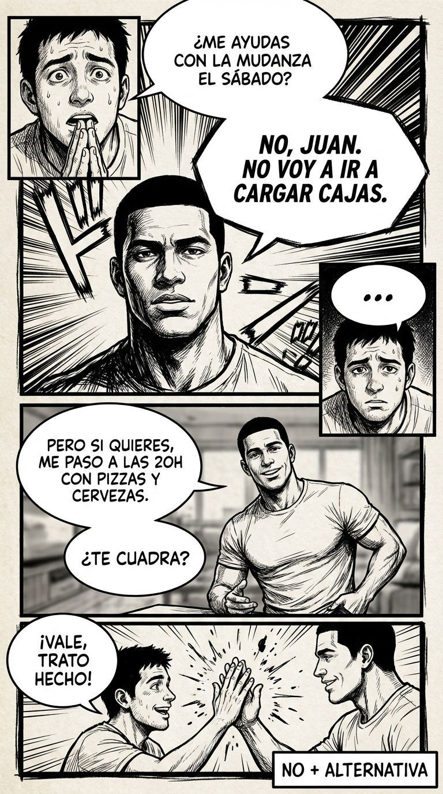

# Día 18 — “No” limpio + alternativa: rechazar sin romper

> **Objetivo de aprendizaje**: Aprender a decir "No" de forma firme y definitiva a la petición, pero manteniendo la relación con una oferta alternativa.

## Relato

Un amigo le pide a Mike que le ayude con una mudanza el sábado. Mike odia las mudanzas y ese sábado quiere descansar.
El instinto de complacer le sugiere una excusa débil: "Uff, es que me duele la espalda...". Pero Mike sabe que las excusas huelen a mentira.
La tentación de ser cortante también aparece: "Ni de coña, paso". Pero eso dañaría la amistad.

Mike elige el **[No + Alternativa]**.
—**[No limpio:]** No, Juan. No voy a ir a cargar cajas el sábado.

Pausa de un segundo. Deja que el No aterrice y sea respetado. Juan ve que es definitivo.
—**[Alternativa:]** Pero si quieres, me paso a las 20:00 con unas pizzas y cervezas al piso nuevo para celebrar. ¿Te cuadra?

Juan sonríe.
—Vale, ¡trato hecho!
    

Mike no ha cargado cajas. Pero tampoco ha quedado como un mal amigo. Ha redefino su contribución (pizzas vs. cajas) en sus propios términos.

## Explicación Profunda

Decir "No" es el acto fundacional de la soberanía personal. Si no puedes decir No, tu Sí no vale nada.
El problema es que a menudo mezclamos el No con la justificación.
"No puedo porque..." -> Le das al otro un argumento para debatir. ("¡Pero si eso se tarda poco!", "¡Tu tía puede esperar!").

El **No Limpio** es un No que se sostiene por sí mismo. "No voy a ir". Punto. Es una declaración de voluntad, no una consecuencia de las circunstancias.

La **Alternativa** es el suavizante social. Dice: "Te rechazo la *petición*, pero no te rechazo a *ti*". Ofreces algo que SÍ quieres dar (pizzas, otro horario, un contacto).
Ecuación: **Límite Firme + Oferta Generosa = Respeto + Cariño.**

## Síntesis de Ideas Clave

*   **El Derecho al No**: Tienes derecho a rechazar cualquier petición sin dar explicaciones. "No" es una frase completa.
*   **La Contra-Oferta**: Transforma un conflicto (Tú quieres A, Yo no quiero A) en una negociación constructiva (Hagamos B).
*   **Evitar la Deuda**: Si aceptas algo que no quieres hacer, generas resentimiento. Es mejor un No honesto hoy que un Sí falso que te cobrarás mañana con mala cara.

## Ejemplos Prácticos

### 1. Petición Laboral Extra
*   **Situación**: Jefa: "¿Te puedes quedar hasta las 20:00 para acabar esto?"
*   **Acción**: No + Plan B.
*   **Frase**: *"Hoy no puedo quedarme más tarde, tengo compromiso. **[Alternativa]** Mañana llego media hora antes y lo dejo listo a primera hora. ¿Te sirve?"*
*   **Por qué funciona**: Defiendes tu horario pero garantizas el resultado (el trabajo se hace).

### 2. Invitación a Boda/Evento Lejano
*   **Situación**: "¡Tenéis que venir a la boda en Cancún!"
*   **Acción**: No radical + Regalo.
*   **Frase**: *"Suena espectacular, pero no vamos a ir. **[Alternativa]** Eso sí, contad con nosotros para invitaros a una cena de lujo cuando volváis y que nos contéis todo."*
*   **Por qué funciona**: La cena es mucho más barata que el viaje a Cancún, y quedas genial.

### 3. Prestar Dinero
*   **Situación**: "¿Me dejas 500 euros?"
*   **Acción**: No a la deuda + Ayuda no financiera.
*   **Frase**: *"Tengo por regla no prestar dinero a amigos, así que es un no. **[Alternativa]** Pero puedo ayudarte a revisar tus gastos o invitarte a comer hoy para hablar del tema."*
*   **Por qué funciona**: Proteges tu dinero y la amistad (las deudas rompen amistades).

## Señales de Progreso

1.  **Sin culpa**:
    *   *¿Dices No y no te sientes mal?* Has entendido que decir No es cuidar de ti, no atacar al otro.
2.  **No inventas excusas**:
    *   *¿Has dejado de matar a abuelas imaginarias?* Dices "no me apetece" o "no puedo" y ya. La verdad te hace libre.
3.  **La gente se adapta**:
    *   *¿Aceptan tu alternativa?* Descubres que, a menudo, la gente solo quiere *algo* de ayuda, no necesariamente lo que pidieron exacto.

## Errores Habituales

*   **El "No" Blando (Quiza)**
    *   *Se ve así*: "Bueno, ya veré, está complicado..."
    *   *Resultado*: Te volverán a preguntar. Prolongas la agonía.
    *   *Alternativa*: "Es un no."
*   **Ofrecer una Alternativa que tampoco quieres**
    *   *Se ve así*: "No puedo el sábado, pero voy el domingo" (Y también odias ir el domingo).
    *   *Resultado*: Sigues atrapado.
    *   *Alternativa*: Solo ofrece lo que das de corazón. Si no quieres dar nada, di No y punto.

## Conclusiones

El "No" define tus bordes. Si no tienes bordes, te diluyes. Al usar la fórmula "No + Alternativa", te conviertes en una persona definida pero colaborativa. Alguien con quien se puede contar... bajo sus propias condiciones.

## Práctica Deliberada

*   **Ficha**: [Juego 5: No + Alternativa](../juegos/juego_05.md).
*   **Por qué ayuda**: Entrena el músculo de aguantar la mirada tras el "No" y la creatividad para inventar alternativas rápidas.

## Referencias

*   [How to Say No](https://thepowermoves.com/how-to-say-no/): Guía completa para negativas asertivas.
