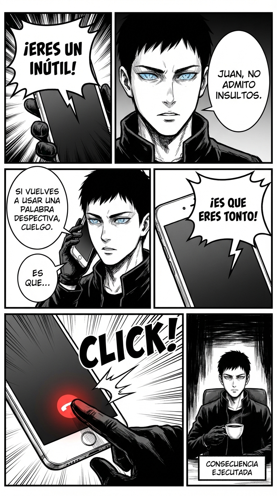

# Día 19 — Límite conductual: hasta aquí y no más

> **Objetivo de aprendizaje**: Aprender a detener comportamientos inaceptables estableciendo una línea roja clara y una consecuencia proporcional, sin necesidad de enfadarse.

## Relato

En una discusión telefónica, el interlocutor empieza a insultar a Mike: "Eres un inútil, no te enteras de nada...".

Mike no insulta de vuelta. Tampoco cuelga sin avisar.
Con voz gélida, interrumpe:
—**[Límite:]** Juan, no admito insultos.
—Es que me sacas de quicio...
—**[Consecuencia Advertida:]** Si vuelves a usar una palabra despectiva, cuelgo el teléfono. ¿Estamos?

Juan refunfuña pero se calma. Siguen hablando.
Dos minutos después, Juan suelta: "¡Es que eres tonto!".

Mike no dice nada. **Click**. Cuelga.
No le bloquea para siempre. Simplemente ejecuta la consecuencia anunciada.
A los 10 minutos, Juan escribe un WhatsApp: "Perdona. Se me ha ido. ¿Hablamos?".
Mike contesta: "Si es con respeto, sí. Llamo ahora".

Mike ha enseñado a Juan a tratarle. Ha sido un adiestramiento conductual.

## Explicación Profunda

Un **Límite** no es una petición ("por favor no hagas eso"). Un límite es una **declaración de causa-efecto**: "Si haces X, ocurre Y".
Para que un límite funcione, necesitas:
1.  **Claridad**: Qué conducta exacta está prohibida (insultos, gritos, fumar en el coche).
2.  **Proporcionalidad**: La consecuencia no puede ser nuclear ("te mato"), tiene que ser ejecutable (me voy, cuelgo, no te dejo el coche).
3.  **Ejecución Implacable**: Si cruzan la línea y no ejecutas la consecuencia, tu límite es una mentira. Has perdido toda credibilidad.

Es fundamental hacerlo sin ira. Mike no cuelga "enfadado". Cuelga "técnicamente". Como un árbitro que saca tarjeta roja. No odia al jugador, solo aplica el reglamento. Eso le da una autoridad inmensa.

## Síntesis de Ideas Clave

*   [TPM: Boundaries] **Los Límites definen la Relación**: Tú enseñas a la gente cómo tratarte. Lo que toleras, persiste.
*   [TPM: Power Dynamics] **La Amenaza Creíble**: Solo amenaza con lo que estés 100% dispuesto a cumplir. Si dices "me divorcio" y no lo haces, has perdido tu palabra.
*   [TPM: High Value] **Retirada de Atención**: A veces, la mejor consecuencia es retirar tu presencia. "Si te pones así, me voy". Tu atención es el premio; quitarla es el castigo.

## Ejemplos Prácticos

### 1. El Niño que Pega
*   **Situación**: Tu hijo te pega una patada jugando.
*   **Límite**: "No se pega. Eso duele."
*   **Consecuencia**: "Si pegas otra vez, se acaba el juego y vamos a casa."
*   **Ejecución**: Pega -> Te levantas, coges las cosas y te vas. Sin gritos. Solo hechos.

### 2. El Cliente que llama el Domingo
*   **Situación**: Llamadas fuera de horario.
*   **Límite**: No cogerlo. (Límite pasivo).
*   **Consecuencia**: Si insiste, mensaje el lunes: "Como te comenté, desconecto los fines de semana. Para urgencias reales, mail."
*   **Ejecución**: Nunca contestes un domingo. Si contestas una vez, has roto el límite.

### 3. La Pareja Celosa Inquisitiva
*   **Situación**: "¿Dónde has estado? ¿Con quién? Déjame ver el móvil."
*   **Límite**: Privacidad.
*   **Frase**: *"Te quiero, pero no voy a aceptar interrogatorios ni a enseñarte mi móvil. La confianza es básica para mí."*
*   **Consecuencia**: *"Si sigues exigiendo el móvil, no vamos a poder seguir hablando de esto ahora. Me voy a dar un paseo."*

## Señales de Progreso

1.  **Miedo superado**:
    *   *¿Te atreves a ejecutar?* Colgar el teléfono o irse de una sala da vértigo la primera vez. Luego da poder.
2.  **Respeto automático**:
    *   *¿La gente se regula sola?* Saben que contigo "no se juega". Juan ya no insulta a Mike, aunque insulte a otros. Tú eres zona libre de insultos.
3.  **Paz mental**:
    *   *¿Dejas de intentar "cambiar" a la gente?* No intentas que Juan sea buena persona. Solo controlas cómo interactúa contigo. Es mucho más fácil.

## Errores Habituales

*   **Poner límites borrosos**
    *   *Se ve así*: "Trátame bien." (¿Qué es bien?).
    *   *Alternativa*: "No me subas la voz." (Medible).
*   **No ejecutar (Perro ladrador)**
    *   *Se ve así*: "¡Que me voy eh! ¡Que me voy!" (Y no te vas).
    *   *Resultado*: Te pierden el respeto.
    *   *Alternativa*: Avisa una vez. A la segunda, actúa en silencio.
*   **Ejecutar con rabia**
    *   *Se ve así*: Colgar dando un portazo y gritando.
    *   *Resultado*: Pareces inestable.
    *   *Alternativa*: Calma robótica. "Esto se acabó."

## Conclusiones

Los límites son el sistema inmunitario de tu personalidad. Sin ellos, te invaden las infecciones (abusos, faltas de respeto, ladrones de tiempo). Tener límites fuertes te permite ser *más* amable, porque sabes que estás seguro. No necesitas agresividad preventiva cuando tienes un botón de "Eject" que funciona.

## Práctica Deliberada

*   **Ficha**: [Juego 11: Tocar No Es Gratis](../juegos/juego_11.md).
*   **Por qué ayuda**: Entrena el límite físico. Es el más primario. Si puedes defender tu piel, puedes defender tu tiempo y tu dignidad.

## Referencias TPM

*   [Boundaries 101](https://thepowermoves.com/boundaries/): Cómo establecer y mantener líneas rojas.
