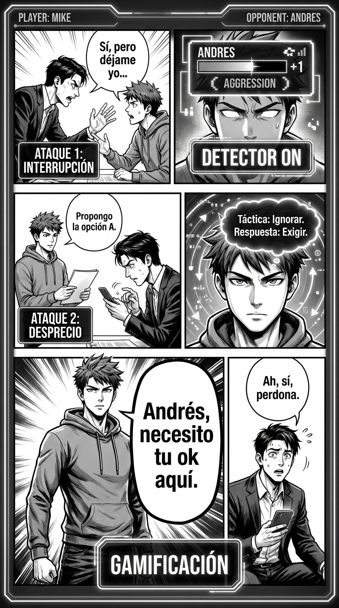

# Día 22 — Detector de jugadas: puntúa el juego

> **Objetivo de aprendizaje**: Aprender a leer las interacciones sociales como un "partido" para detectar tácticas manipuladoras en tiempo real y no tomarlas personal.

## Relato

Reunión de proyecto. Andrés, un compañero competitivo, empieza a desplegar su arsenal para desestabilizar. Primero corta a Mike a mitad de frase: "Sí, pero déjame yo...". Luego, cuando Mike intenta recuperar el hilo, Andrés mira el móvil ostensiblemente. Finalmente, suelta una risa burlona:

—Esa idea es muy... "creativa", Mike.

Mike no se enfada ni se hace pequeño. En su mente, enciende el **[Detector de Jugadas]**. No ve ataques personales, ve puntos en un marcador táctico.
*"Interrupción... +1 punto de agresividad."*
*"Mirar móvil... +1 punto de desprecio."*

Al etiquetarlo, el dolor desaparece. Mike decide jugar.
—**[Freno]**: Espera, Andrés, no he acabado —dice con calma plana—. Y sobre lo de "creativa"... **[Pregunta de Aclaración]**: ¿te refieres a que es arriesgada o a que no la ves viable?

Andrés titubea, sorprendido por la falta de reacción emocional.
—Bueno, que es rara... —murmura.

Mike sonríe internamente. Ha neutralizado tres ataques sin subir el pulso.

## Explicación Profunda

El primer paso para defenderse es **ver el ataque**.
Muchos ataques de estatus pasan desapercibidos conscientemente, pero tu cuerpo los nota (se te cierra el estómago, te pones rojo). Eso es porque tu cerebro reptiliano detecta la amenaza pero tu neocórtex no sabe nombrarla.

El **Detector de Jugadas** consiste en etiquetar mentalmente lo que pasa.
*   **Ad Hominem**: Atacar a la persona, no al argumento.
*   **Straw Man (Hombre de Paja)**: Distorsionar lo que dijiste para atacarlo fácil.
*   **Gaslighting**: Negar tu realidad ("te lo inventas").
*   **Triangulación**: Meter a un tercero para presionarte.

Cuando etiquetas ("Ah, esto es un Straw Man"), recuperas el control. Pasas de víctima a observador. Y un observador puede elegir la mejor respuesta.

## Síntesis de Ideas Clave

*   [TPM: Power Moves] **Gamificación Social**: Ver la vida como un juego de poder no es cínico, es liberador. Te permite jugar mejor sin sufrir tanto.
*   [TPM: Social Intelligence] **Disociación Emocional**: Al analizar la técnica del otro, te olvidas de sentirte ofendido. Tu cerebro pasa de "modo sentir" a "modo pensar".
*   [TPM: Machiavellianism] **Conoce a tu enemigo**: La gente manipuladora repite patrones. Si detectas su jugada favorita, puedes anticiparte.

## Ejemplos Prácticos

### 1. El "Pero" infinito
*   **Jugada**: Dices algo y el otro dice "Sí, pero..." constantemente para quedar por encima.
*   **Etiqueta**: "Juego de Superioridad Intelectual".
*   **Contra**: "Veo que tienes muchos peros. ¿Cuál es tu propuesta concreta?"

### 2. El Elogio con Puñalada
*   **Jugada**: "Para ser nuevo, no lo has hecho mal".
*   **Etiqueta**: "Cumplido de revés (Backhanded compliment)".
*   **Contra**: "Gracias. La experiencia ayuda." (Ignoras la puñalada, aceptas el elogio).

### 3. La Prisa Falsa
*   **Jugada**: "Firma aquí ya, que no hay tiempo".
*   **Etiqueta**: "Falsa Urgencia".
*   **Contra**: "Si no hay tiempo de leer, no hay firma".

## Señales de Progreso

1.  **Sonrisa interna**:
    *   *¿Te ríes por dentro?* Cuando ves a alguien intentando una manipulación burda, te hace gracia. "Mira, está intentando un Love Bombing".
2.  **Tiempo de reacción**:
    *   *¿Respondes antes?* Antes tardabas dos días en darte cuenta ("¡me insultó!"). Ahora lo ves en el segundo.
3.  **Menos drama**:
    *   *¿Te llevas menos disgustos?* Entiendes que la gente juega sus cartas por sus propios traumas/ambiciones, no por ti.

## Errores Habituales

*   **Decir la etiqueta en voz alta (Pedante)**
    *   *Se ve así*: "¡Ah, estás haciéndome Gaslighting!"
    *   *Resultado*: Pareces un psicólogo de sofá. Cae mal.
    *   *Alternativa*: Úsalo para ti. En voz alta di: "No recuerdo que eso pasara así".
*   **Ver fantasmas**
    *   *Se ve así*: Pensar que todo es un ataque.
    *   *Alternativa*: Navaja de Hanlon. "No atribuyas a la maldad lo que se explica por la estupidez". A veces la gente es torpe, no mala.

## Conclusiones

Bienvenido a Matrix. Ahora ves el código cayendo. No puedes "des-verlo". Usa esta visión para protegerte a ti y a los tuyos, no para volverte un paranoico. El objetivo de detectar el juego es poder jugar limpio y ganar.

## Práctica Deliberada

*   **Ficha**: [Juego 7: Detector en Vídeo](../juegos/juego_07.md) (Analizar vídeos de políticos/famosos es gran práctica).
*   **Reto**: Mira un debate político en TV. Cuenta cuántas veces se interrumpen y cuántas falacias lógicas usan. Es el gimnasio perfecto.

## Referencias TPM

*   [Power Moves List](https://thepowermoves.com/power-moves/): La enciclopedia de las jugadas.
