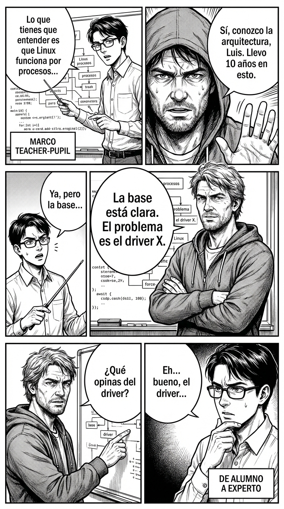

# Día 27 — “Teacher–pupil”: el alumno perpetuo se gradúa hoy

> **Objetivo de aprendizaje**: Identificar cuando alguien te coloca en el rol de "alumno ignorante" para elevar su propio estatus, y aprender a romper hace marco para relacionarte de igual a igual.

## Relato

Mike está explicando cómo arregló el servidor. Un compañero, "Sabelotodo", le interrumpe:
—A ver, Mike, lo que tienes que entender es que los servidores Linux funcionan por procesos... (Empieza una explicación básica de 1º de carrera).

Mike está explicando cómo arregló el servidor. Un compañero, "Sabelotodo", le interrumpe con aire de suficiencia:
—A ver, Mike, lo que tienes que entender es que los servidores Linux funcionan por procesos... —y se lanza a una explicación básica de primero de carrera.

Sabelotodo está usando el marco **[Teacher-Pupil]**: se pone de Profe y relega a Mike a Alumno. Si Mike asiente y dice "gracias", acepta la subordinación.

Mike decide cortar la clase magistral.
—**[Interrupción de Validación]**: Sí, conozco perfectamente la arquitectura de procesos, Luis. Llevo 10 años en esto.

Luis intenta seguir: "Ya, pero es para que entiendas la base...".
Mike no le deja bajar el nivel.
—**[Re-encuadre a Objetivo]**: La base está clara. El problema específico aquí es el driver X. Hablemos de eso. ¿Qué opinas del driver?

Con tres frases, Mike ha validado su competencia, rechazado la lección básica e impuesto un tema de nivel experto. Ahora son dos ingenieros debatiendo, no un maestro y un becario.

## Explicación Profunda

El marco **Teacher-Pupil (Maestro-Alumno)** es seductor porque parece "ayuda". Pero a menudo es dominancia disfrazada.
El "Maestro" te explica cosas que ya sabes, o te da consejos que no has pedido, para sentirse sabio y superior.
El "Alumno" asiente, toma notas y agradece.

El peligro es quedarse atrapado en el rol de Alumno eternamente. Si siempre te tratan como aprendiz, nunca te darán el ascenso, el respeto o el liderazgo.
Para graduarte, tienes que **demostrar competencia**. Tienes que decir: "Ya lo sé. Pasemos al siguiente nivel".

## Síntesis de Ideas Clave

*   **Teacher-Pupil**: Uno de los marcos de poder más estables. Romperlo requiere demostrar que tú también tienes conocimientos.
*   **Consejos no solicitados**: Suelen ser críticas disfrazadas. "Deberías vestir mejor" = "Vistes mal y yo tengo mejor gusto". Recházalos amablemente.
*   **Igualar el Nivel**: Si él usa jerga técnica, usa tú jerga técnica. Si él cita un libro, cita tú otro. Demuestra que jugáis en la misma liga.

## Ejemplos Prácticos

### 1. El Cuñado que te explica la vida
*   **Situación**: "Lo que tu tienes que hacer con tu dinero es invertir en cripto..."
*   **Acción**: Cierre de experto.
*   **Frase**: *"Gracias, tío. Ya tengo mi propia estrategia de inversión diversificada y me va bien. No busco consejos ahora."*
*   **Por qué funciona**: "Tengo mi estrategia" = Soy un adulto responsable, no un niño perdido.

### 2. El Compañero que te explica tu trabajo (Mansplaining)
*   **Situación**: Te explica algo obvio de tu campo.
*   **Acción**: Meta-comentario de obviedad.
*   **Frase**: *"Correcto. Eso es el estándar de la industria. Lo que estamos debatiendo aquí es la excepción del caso B..."*
*   **Por qué funciona**: "Es el estándar" implica "eso lo sabe todo el mundo, no has dicho nada nuevo". Le quitas el aire de gurú.

### 3. El Jefe Micromanager
*   **Situación**: Te dice paso a paso cómo escribir un email.
*   **Acción**: Petición de autonomía.
*   **Frase**: *"Entiendo el objetivo del mail. Déjame redactarlo a mi manera y te paso el borrador final. Prefiero enfocarme en el resultado que en el microsistema."*

## Señales de Progreso

1.  **Interrumpes las lecciones**:
    *   *¿Ya no aguantas chapas?* Cuando alguien empieza a explicarte el abecedario, le dices "me sé las letras, vamos a las frases". Valoras tu tiempo.
2.  **Aportas valor**:
    *   *¿Hablas tú también?* La conversación se vuelve bidireccional. No solo recibes info, también la das.
3.  **Te piden opinión**:
    *   *¿Consultoría inversa?* El "Maestro" empieza a preguntarte "¿Y tú qué harías?". Has logrado el salto de estatus.

## Errores Habituales

*   **Hacerse el tonto para no ofender**
    *   *Se ve así*: Asentir a explicaciones obvias para que el otro se sienta listo.
    *   *Resultado*: Te etiquetan como "majete pero simple".
    *   *Alternativa*: "Sí, exacto, como vimos en el proyecto X..." (Conectar con experiencia previa).
*   **Pelearse ("¡Que ya lo sé pesada!")**
    *   *Se ve así*: Agresividad reactiva.
    *   *Resultado*: Pareces un adolescente rebelde (que sigue siendo un marco de niño).
    *   *Alternativa*: Frialdad profesional. "Conozco el dato."

## Conclusiones

Nadie te da el título de "Igual" o "Experto". Lo tienes que tomar. Deja de comportarte como si estuvieras en el colegio esperando permiso para hablar. Tienes experiencia, tienes criterio. Ponlo sobre la mesa.

## Práctica Deliberada

*   **Ficha**: [Juego 10: Anti-Teacher-Pupil](../juegos/juego_10.md).
*   **Por qué ayuda**: Role-play donde uno hace de sabelotodo insoportable. Practica frases de corte: "Entendido", "Pasemos a la acción", "Ese punto lo tengo cubierto".

## Referencias

*   [Teacher-Pupil Frames](https://thepowermoves.com/teacher-pupil-frames/): Análisis profundo de esta dinámica.
