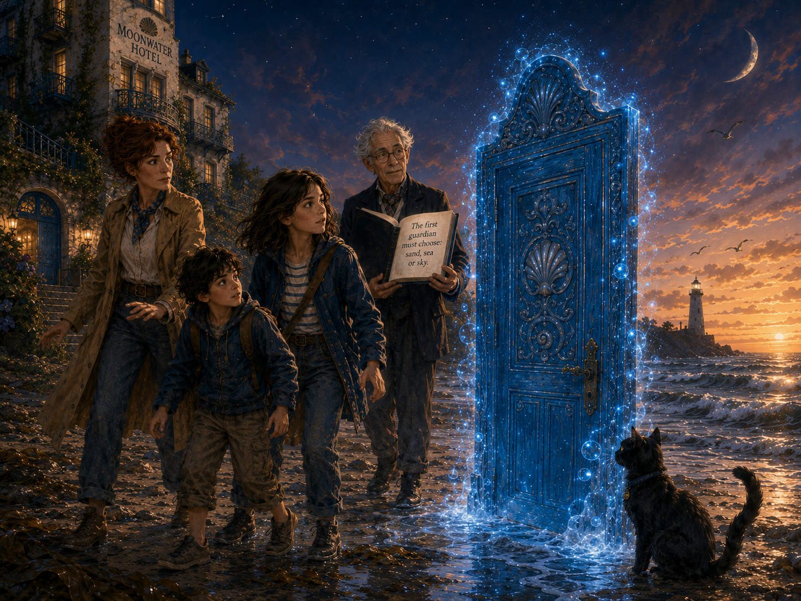
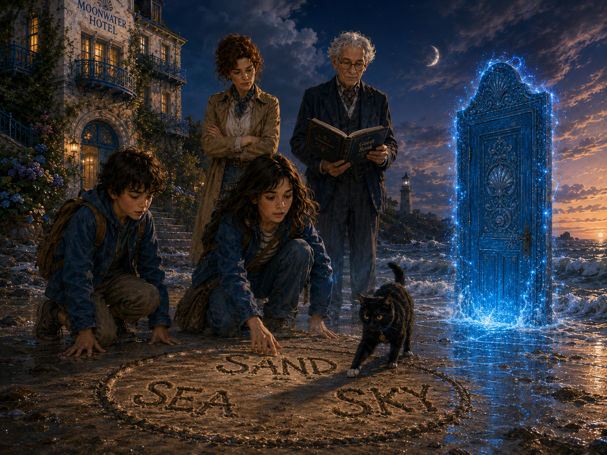
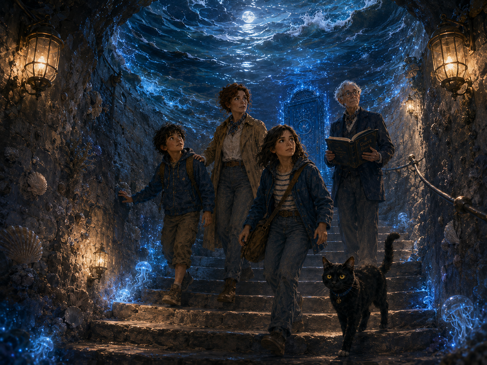
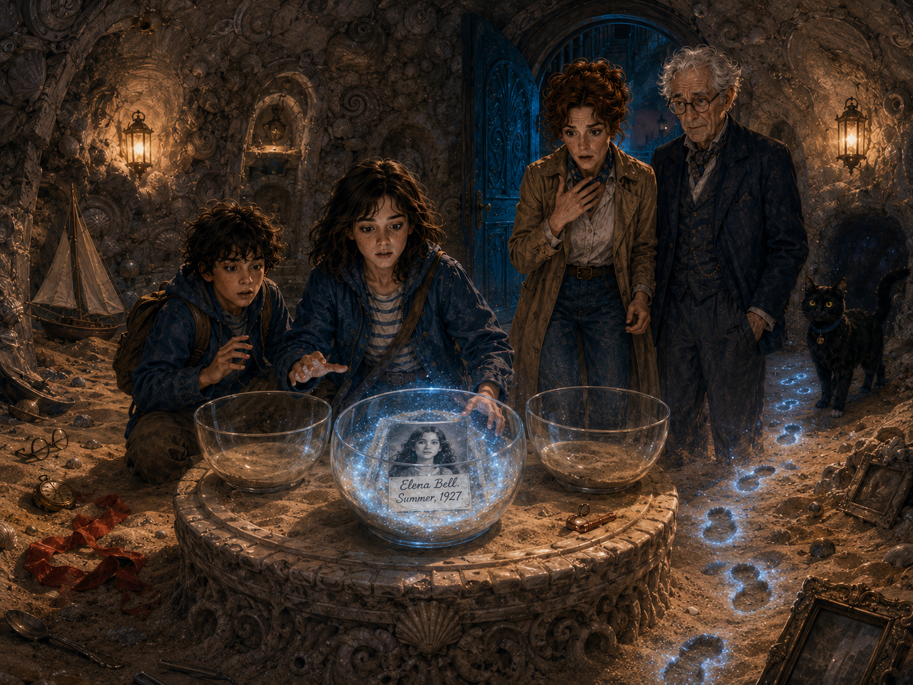

# Chapter 2 — Sand, Sea or Sky

## Helpful words

| English      | Español          |
| ------------ | ---------------- |
| choice       | elección         |
| tide         | marea            |
| to return    | volver           |
| to glow      | brillar          |
| warning      | advertencia      |
| footprint    | huella           |
| ceiling      | techo            |
| to trust     | confiar          |
| rule         | regla            |
| to sink      | hundirse         |
| to breathe   | respirar         |
| chamber      | cámara / sala    |
| to disappear | desaparecer      |
| safe         | seguro / a salvo |

---

The blue door stood in the wet sand as if it had always been there.

It was tall, old and impossible. Silver shells decorated its frame, and blue light moved around it like tiny stars under water. The sea was behind it. The hotel was behind them. The lighthouse watched from its black rock, far away, with one pale light at the top.

For a few seconds, nobody moved.

Then Aunt Iris found her voice.

“No,” she said.

Sam looked at her. “No what?”

“No door. No blue light. No strange book. No choosing anything. We are going back inside, and we are going to have a very normal conversation with a very normal hotel manager.”

Mr Vale, who was still holding the dark blue Guest Book, raised one eyebrow.

“I am not sure I can promise the normal part,” he said.

Aunt Iris turned to him so quickly that her coat moved in the sea wind.

“Then start with the truth.”

Mr Vale looked at the open book. The words were still shining on the page:

**The first guardian must choose: sand, sea or sky.**

Nora read the sentence again. The letters did not look written. They looked alive, as if the ink was breathing.

“What does it mean?” she asked.

“It means,” said Mr Vale, “that the hotel has opened the first door.”

“Yes, we can see that,” said Sam. “The big glowing door is a strong clue.”

Nora gave him a look, but she almost smiled.

Mr Vale closed the Guest Book halfway, then opened it again. The same words returned.

“The Moonwater Hotel does not force guests to enter,” he said. “But when a door wakes up, it asks a question. And if the question is answered, the path opens.”

“And if we do not answer?” asked Aunt Iris.

Mr Vale looked at the sea.

The water was closer than before.

“If you do not answer,” he said, “the tide will answer for you.”

Sam took one small step away from the water.

“I don’t like that sentence.”

“Neither do I,” said Nora.

Morrow, the black cat, sat beside the blue door and began to clean his white paw. He looked completely calm, which made everything feel even stranger.

Aunt Iris crossed her arms.

“They are children,” she said. “They are not guardians. They are not choosing anything.”

Mr Vale did not answer at once. He looked at Nora, then at Sam, then at Aunt Iris.

“The Guest Book wrote three names,” he said quietly.

Aunt Iris looked at the page again. Nora saw her face change when she read the names.

Nora Bell.
Sam Bell.
Iris Bell.

For a moment, Aunt Iris did not look angry. She looked afraid.

“Why our names?” Nora asked.

“That,” said Mr Vale, “is one of the first questions.”

“And do you have an answer?” asked Aunt Iris.

“I have several answers,” said Mr Vale. “Most of them are incomplete, and some of them may make you more annoyed with me.”

“That is already happening,” said Aunt Iris.

Sam pointed at the door. “Maybe we should choose sky. Sky sounds safest. It is up. Water and sand are down, and down is usually where scary things live.”

Nora looked at the door carefully. There were three carved pictures on it. Near the bottom, there was a shell half-buried in sand. In the middle, there was a wave. Near the top, there was a small lighthouse under three stars.

Sand.
Sea.
Sky.

The words on the Guest Book began to shine brighter.

A cold wind came from the open space around the door, although there was no space behind it. Nora could see only blue darkness inside, and stairs going down.

“That door does not look like sky,” she said.

“It could be a trick,” said Sam. “Maybe you go down first and then up. Like in some museums.”

“This is not a museum.”

“That is also clear.”

Aunt Iris took Sam’s hand, then Nora’s.

“We are leaving.”

She pulled them gently but firmly toward the hotel.

At that exact moment, the blue door made a low sound.

It was not loud, but Nora felt it in her chest.

The wet sand around their feet shifted. Not much. Just enough to make them stop.

Small lines appeared in the sand between them and the hotel. The lines moved by themselves, drawing a circle around the group. Then three words appeared on the ground, written in wet sand:

**SAND**
**SEA**
**SKY**

Sam stared at the words.

“The beach can write,” he said. “That is new.”

Aunt Iris looked at Mr Vale.

“Stop this.”

“I can’t,” said Mr Vale. “Not now.”

“Then who can?”

Mr Vale looked at the children.

Nora did not like that answer.

The tide moved again. A thin line of water ran toward the circle and touched the word **SEA**. The letters glowed blue. Then the water pulled back.

Morrow stood up and walked around the three words. He smelled **SKY**, ignored **SEA**, and placed his white paw directly on **SAND**.

Sam opened his mouth.

“Oh. The cat is voting.”

“Morrow does not vote,” said Mr Vale. “He suggests.”

“So the cat has a job,” said Sam.

“The cat has many jobs.”

Nora crouched beside the words. The sand under **SAND** was dry, even though everything around it was wet. She touched it with one finger.

It was warm.

“The first clue was in the hotel guide,” she said slowly. “The tide remembers everything. Then Morrow took us to the sand. The box was under the sand. The door came from under the sand.”

Sam nodded. “And now the cat says sand.”

“Morrow suggests sand,” corrected Mr Vale.

Aunt Iris shook her head.

“No. Absolutely not. We are not making magical decisions because a cat has opinions.”

Morrow looked offended.

Nora stood up.

“I don’t think it is only the cat,” she said. “The question is not asking where we want to go. It is asking what this door is.”

Sam looked at the blue door.

“A sand door?”

“A door beneath the tide,” said Nora. “A door hidden under the beach. A door that woke when the sea went away. I think the first answer has to be sand.”

Aunt Iris looked at Nora with a mixture of pride and fear.

“You sound too sure.”

“I’m not sure,” said Nora. “But it makes sense.”

Mr Vale nodded once.

“Sense is useful here,” he said. “But so is courage.”

Sam took a deep breath and looked at the water. It was closer now, moving in thin silver lines over the beach.

“I still prefer sky,” he said. “But I admit sand has better evidence.”

Aunt Iris closed her eyes for one second.

“We are not entering that door alone,” she said.

“No,” said Mr Vale. “You are not.”

“Are you coming with us?”

Mr Vale looked at the blue doorway. For the first time, he seemed less certain.

“I can walk with you to the first chamber,” he said. “No further, unless the room allows it.”

“The room allows it?” repeated Aunt Iris.

“The rooms have rules.”

“Of course they do,” said Sam. “Normal rooms are boring now.”

The sea moved again. This time, the water touched the edge of the blue door and hissed softly, like a candle in rain.

The Guest Book turned a page by itself.

New words appeared.

**Choose before the tide returns.**

Aunt Iris looked at Nora and Sam.

“This is not permission to be reckless,” she said. “If we go in, we stay together. We do not run. We do not touch strange things. We do exactly what I say.”

Sam raised a hand.

“What if the cat says something different?”

“The cat is not in charge.”

Morrow gave a short, sharp sound.

Aunt Iris pointed at him.

“You are also not in charge.”

Nora almost laughed, but the blue door glowed brighter, and the laugh disappeared before it reached her mouth.

Mr Vale stepped closer to the words in the sand.

“The choice must be spoken,” he said.

Nora looked at Sam. Sam looked at Aunt Iris. Aunt Iris looked at the door, then at the water, then at the hotel.

Finally, she nodded once.

“Together,” she said.

Nora swallowed.

“We choose sand.”

Nothing happened.

Sam leaned forward.

“Maybe louder?”

Nora tried again, this time with Sam and Aunt Iris speaking with her.

“We choose sand.”

The word **SAND** rose from the beach in a shower of golden dust. For a moment, the letters floated in the air in front of the blue door. Then they broke into thousands of tiny lights and disappeared into the keyhole.

The door opened wider.

Behind it, the stairs were no longer dark. They were made of pale stone, and thin lines of sand ran down the sides like slow waterfalls. The air smelled dry and old, like a closed room in summer.

Morrow walked in first.

“Of course he does,” said Sam.

Mr Vale followed, holding the Guest Book close to his chest. Aunt Iris went next, but she kept one hand on Sam’s shoulder and the other near Nora’s arm, as if she could hold the whole family together by force.

Nora stepped through the door last.

For one strange second, she felt water above her head.

She looked up and gasped.

The ceiling was not stone. It was the beach.

Above them, through a clear blue surface, Nora could see the wet sand, the black rocks, and the moving shapes of waves. It was like standing under a glass floor while the sea walked over it.

Sam stared upward.

“That is… amazing.”

“Do not touch the ceiling,” said Aunt Iris immediately.

“I wasn’t going to.”

“You were thinking about it.”

“I think about many things.”

The stairs led down in a gentle curve. The blue door remained open behind them, but it looked smaller with every step they took, as if distance worked differently there.

Nora counted the steps to feel calmer.

One.
Two.
Three.
Four.

At step twelve, the sound of the sea disappeared.

At step twenty, the air became warmer.

At step thirty, they reached a round chamber.

The Sand Room was not very large, but it felt deep, as if it had been waiting under the beach for longer than the hotel had stood above it. The walls were made of pale stone mixed with shells. The floor was covered with soft golden sand. In the centre of the chamber stood a low table, and on the table there were three empty glass bowls.

Around the walls were objects half-buried in sand.

A small toy boat.
A broken watch.
A pair of old glasses.
A red ribbon.
A silver spoon.
A photograph frame with no photograph inside.

Sam pointed at the objects.

“Treasure?”

“Not exactly,” said Mr Vale.

“Dangerous treasure?”

“Also not exactly.”

Aunt Iris looked around the room.

“What is this place?”

Mr Vale opened the Guest Book. The pages moved slowly, as if searching for the right words.

“The Sand Room keeps what the tide brings back,” he said. “Lost objects. Lost messages. Lost memories. Sometimes lost promises.”

Nora looked at the broken watch. Sand had filled its glass face, but the hands were still moving.

“That watch is working,” she said.

“It remembers time,” said Mr Vale.

“That is not an explanation.”

“No,” he said. “But it is true.”

Sam crouched near the toy boat.

“Can I touch it?”

“No,” said Aunt Iris and Mr Vale at the same time.

Sam pulled his hand back.

“Fine. I was only asking.”

Morrow walked to the low table and jumped onto it. He looked into the first glass bowl, then into the second, then into the third. All three were empty.

“What are the bowls for?” asked Nora.

Mr Vale’s face became serious.

“For the room to decide what you are ready to see.”

Aunt Iris took a slow breath.

“I do not like rooms that decide things.”

“Most people don’t,” said Mr Vale.

Then something moved behind them.

Nora turned quickly.

At first, she thought it was only sand sliding down the wall. But then she saw the marks on the floor.

Footprints.

They appeared one by one in the golden sand.

Small footprints, but not a child’s. Too narrow. Too careful.

They crossed the room from the far wall to the low table, as if an invisible person had just walked past them.

Sam moved closer to Aunt Iris.

“Please tell me old rooms sometimes make fake footprints.”

Mr Vale did not answer.

That was answer enough.

The footprints stopped in front of the middle glass bowl. A thin stream of sand rose from the floor and poured into it. The sand turned blue for a moment, then became still.

Nora stepped closer.

Inside the bowl, something was forming.

A picture.

No, not a picture.

A photograph.

It appeared slowly under the sand, as if the room was remembering it piece by piece.

A girl stood in front of the Moonwater Hotel. She looked about Nora’s age. Her hair was tied with a ribbon, and her dress was old-fashioned. She was smiling, but her eyes looked worried.

Aunt Iris made a small sound.

Nora turned to her.

“What is it?”

Aunt Iris did not answer. Her face had gone pale.

The sand inside the bowl moved again. Under the girl’s feet, words appeared in tiny dark letters:

**Elena Bell.
Summer, 1927.**

Nora looked from the name to Aunt Iris.

“Bell,” she whispered.

Sam’s voice was very quiet.

“Is she family?”

Aunt Iris stared at the photograph as if she had seen a ghost from a story she had tried very hard to forget.

“I don’t know,” she said.

But Nora could hear that this was not the whole truth.

Morrow jumped down from the table and walked toward the far wall. He stopped beside a patch of sand that looked darker than the rest. Then he looked back at them.

The footprints had not disappeared.

In fact, now there were more of them.

Fresh footprints.

Leading to the wall.

Leading through the wall.

And from behind the stone, very faintly, someone whispered:

“Iris?”

Aunt Iris stopped breathing.

The blue door behind them began to close.

**To be continued…**

---

## Easy comprehension questions

1. What three choices appear in the Guest Book?
2. Why does Nora think they should choose sand?
3. What does Morrow do to suggest the answer?
4. What kind of room do they find behind the blue door?
5. What name appears in the photograph?

---

## Useful expressions

* **The hotel has opened the first door.** → El hotel ha abierto la primera puerta.
* **The tide will answer for you.** → La marea responderá por vosotros.
* **It makes sense.** → Tiene sentido.
* **We stay together.** → Permanecemos juntos.
* **That was answer enough.** → Aquello ya era suficiente respuesta.

---

## Talk together

1. Would you choose sand, sea or sky? Why?
2. Do you think Mr Vale is helping them or hiding too much?
3. What do you think happened to Elena Bell?
